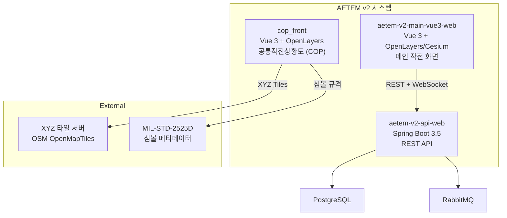
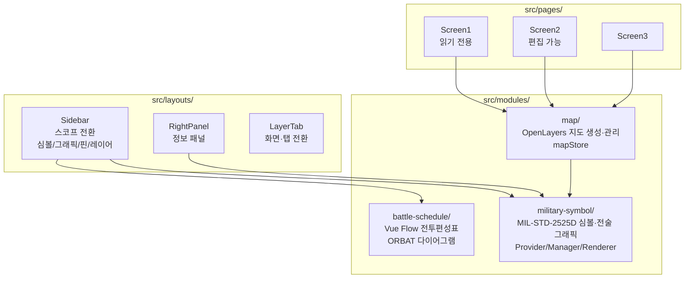
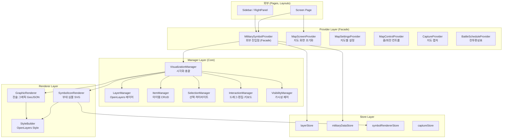
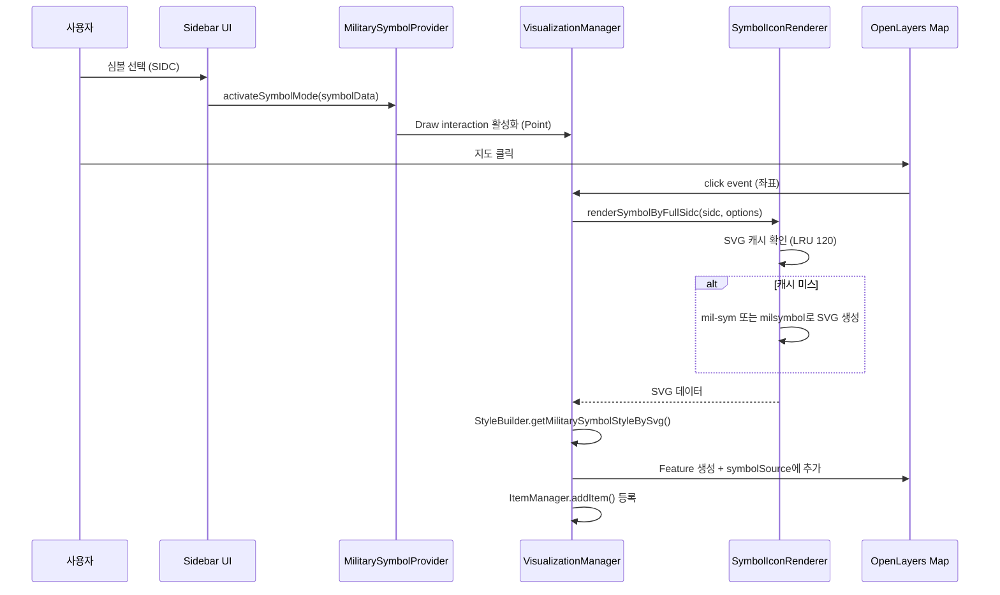
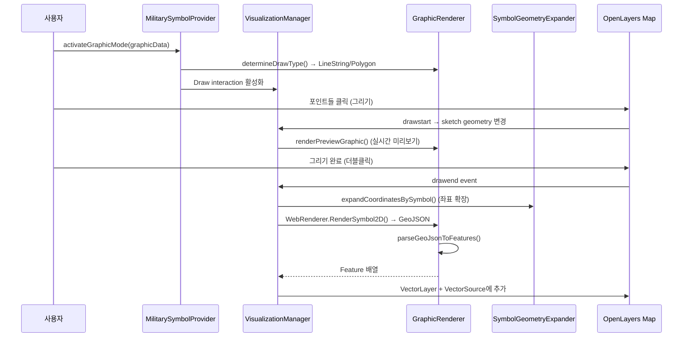
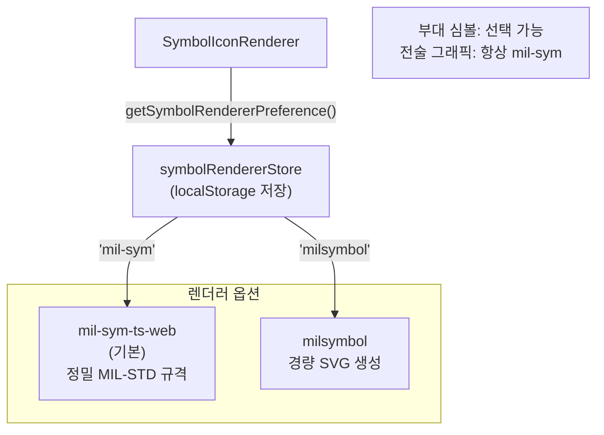
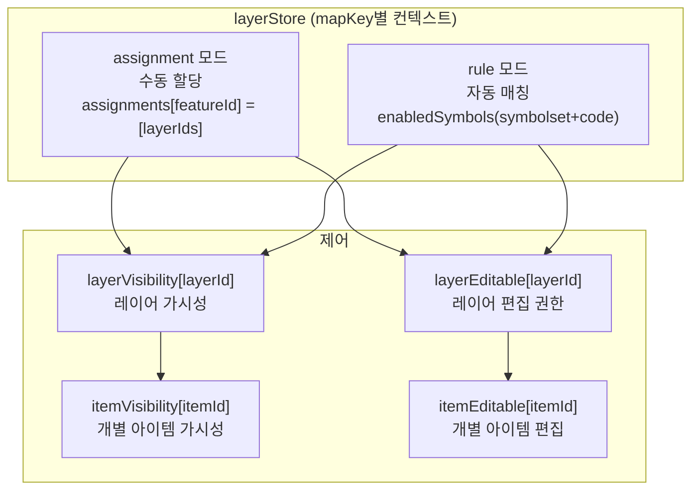
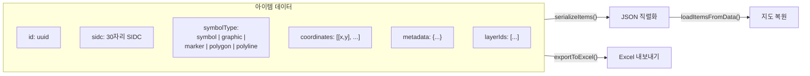

## 전체 시스템 구성

AETEM v2는 3개 프로젝트로 구성되며, COP(cop_front)는 공통작전상황도 전용 프론트엔드입니다.

## 프론트엔드 모듈 아키텍처

cop_front는 **3개의 독립 모듈**로 구성됩니다.

## Provider/Manager 계층 아키텍처

**왜 계층을 나눴나**: 지도·심볼·전술 그래픽·캡처·전투편성표가 한 화면에 얽히면, 페이지와 레이아웃이 OpenLayers 상세와 MIL-STD 렌더러에 직접 의존하게 됩니다. 기능을 바꿀 때마다 여러 화면을 동시에 고쳐야 해 유지보수 비용이 커집니다.

**선택**: **Provider(Facade)** 를 유일한 공개 진입점으로 두고, Manager·Renderer·Store는 모듈 내부에 캡슐화합니다. 화면은 “무엇을 할지”만 Provider에 요청하고, 좌표계·레이어·스타일·캐시 정책은 내부에서 일관되게 처리합니다.

**결과**: 심볼 렌더러 교체나 레이어 규칙 변경이 한 축에 묶여, COP 화면(Screen1~3)을 반복 패턴으로 확장하기 쉽습니다. 아래 구조에서 **외부 코드는 Provider만 접근**하고, 내부 core는 직접 import하지 않습니다.

## 심볼 렌더링 파이프라인

### 부대 심볼 배치 흐름

### 전술 그래픽 그리기 흐름

## 렌더러 교체 전략

런타임에 군사 부호 렌더러를 교체할 수 있습니다.

- **부대 심볼 (symbolset ≠ 25)**: `symbolRendererStore`에 따라 mil-sym 또는 milsymbol 중 선택
- **전술 그래픽 (symbolset 25)**: 항상 mil-sym-ts-web의 `WebRenderer.RenderSymbol2D` 사용
- **SVG 캐시**: LRU 방식 최대 120개 캐싱으로 반복 렌더링 성능 최적화

## 레이어 관리 체계

- **mapKey**: `route.path` (예: `/screen2`) 또는 `containerId`로 맵별 독립 관리
- **assignment 모드**: `assignments[featureId] = [layerIds]`로 수동 할당
- **rule 모드**: `enabledSymbols` (symbolset+code) 패턴으로 자동 매칭
- **쿠키 저장**: 레이어 설정은 쿠키에 영속

## 데이터 직렬화 형식

## OpenLayers 레이어 구조

| 레이어 | 용도 |
|--------|------|
| **symbolLayer** | 부대 심볼 (Point Feature) |
| **geometryLayer** | 전술 그래픽 (Line/Polygon) |
| **annotationLayer** | 텍스트 주석 |
| **pointHandleLayer** | 편집 핸들 포인트 |
| **tempLayer** | 임시 그리기 |
| **previewLayer** | 실시간 미리보기 |
| **editTempLayer** | 편집 중 임시 |
