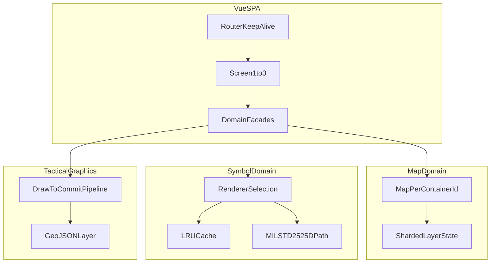

## 핵심 기술 (한 줄 요약)

**Vue 3 + OpenLayers 10** 위에 **MIL-STD-2525D** 심볼·전술 그래픽·**Vue Flow ORBAT**를 얹었고, 외부 타일(XYZ 등)과 브라우저 내 상태만을 전제로 **퍼사드·멀티 맵·이중 렌더 전략**으로 경계를 나눴습니다.

## 기술적 도전과 해결

### Challenge: 지도·군사 심볼·편성표가 한 제품에 얽일 때의 결합도

**상황** — 전장정보 편집기에서 지도 조작, 부대 심볼, 전술 그래픽, 레이어 규칙, 캡처·보내기가 동시에 필요했습니다.

**문제** — 페이지·레이아웃이 OpenLayers와 MIL-STD 렌더러에 직접 의존하면 기능 추가마다 여러 화면을 고쳐야 합니다.

**접근** — “화면이 지도 SDK를 안다” 대신 **퍼사드 + 내부 Manager·Renderer**로 캡슐화하고, 화면은 **대표 진입점 API**만 호출하도록 했습니다.

**해결** — 심볼 도메인 퍼사드 아래에 시각화·레이어·선택·인터랙션 책임을 쪼개고, 렌더러(mil-sym-ts-web / milsymbol) 교체·튜닝도 이 축 안에서만 다루게 했습니다.

**성과** — Screen 1~3을 **동일 패턴으로 확장**할 수 있고, 규격·레이어 정책 변경 시 수정 범위가 모듈에 모입니다.

### Challenge: 멀티 맵·멀티 레이어에서의 상태 일관성

**상황** — 라우트·**화면별 DOM 컨테이너**마다 **독립 Map 인스턴스**와 레이어 가시성·편집 권한이 달라야 했습니다.

**문제** — 전역 단일 스토어는 화면 간 간섭이 나고, 화면마다 저장소를 복제하면 규칙이 갈라집니다.

**접근** — **경로·뷰 단위 키**로 레이어·가시성 상태를 **샤딩**하고, 수동 할당(assignment)과 심볼 패턴 규칙(rule) 두 모드로 가시성을 표현했습니다.

**해결** — 맵 객체·레이어 매핑·규칙 기반 자동 매핑을 **한 상태 계층**에서 파생해 UI(보이기/편집 가능)로 이었습니다.

**성과** — “같은 COP인데 화면마다 다른 작전 뷰”를 **코드 중복 없이** 맞출 수 있었습니다.

### Challenge: 부대 심볼과 전술 그래픽의 요구가 다름

**상황** — 부대 심볼은 **대량·반복**, 전술 그래픽은 **규격·단계적 확정(미리보기 → GeoJSON)**이 중요했습니다.

**문제** — 하나의 렌더 경로만 두면 성능이나 규격·UX 중 하나를 포기하기 쉽습니다.

**접근** — 부대는 **런타임 렌더러 선택 + 캐시**로 처리량을 확보하고, 그래픽은 **규격 우선 단일 파이프라인**(Draw → 확정)으로 고정했습니다.

**해결** — 심볼 쪽은 LRU로 SVG 재생성을 줄이고, 그래픽은 완료 시점에만 레이어·GeoJSON에 반영하는 **단방향 흐름**만 외부에 노출했습니다.

**성과** — **규격 준수**와 **반복 배치 성능**을 한 SPA 안에서 동시에 만족시킬 수 있었습니다.

### Challenge: 아키텍처 의도가 코드 리뷰·온보딩까지 전달되지 않는다

**상황** — 퍼사드·샤딩·이중 렌더 전략은 **한두 파일을 열어보면 이유가 보이지 않아**, 신규 투입자가 화면에서 `Map`/`Layer`를 직접 만지는 우회 코드를 넣기 쉽습니다.

**문제** — 구두로만 설명하면 버전이 갈리고, PR마다 “왜 여기서는 퍼사드를 거쳐야 하는지”를 반복해야 합니다.

**접근** — **저장소 내 Markdown**으로 (1) 모듈 경계 다이어그램과 공개 진입점 목록, (2) 뷰 단위 상태 키 네이밍·금지 패턴, (3) **ADR 형식 1페이지짜리** 결정 기록(렌더러 분기, LRU 정책, assignment/rule)을 두었습니다.

**해결** — 아키텍처 탭과 동일한 용어를 문서 제목에 쓰고, Mermaid는 **문서와 포트폴리오를 맞춰** 갱신했습니다.

**성과** — 리뷰 시 **문서 한 링크로 맥락을 공유**할 수 있고, “임시로만” 우회한 결합이 줄었습니다.

## 모듈 구조 한눈에

## 설계 메모

- 시퀀스·레이어 전체 목록은 **저장소 `docs/`(또는 패키지 README)**에 두고, 포트폴리오에서는 **퍼사드 경계**와 **뷰 단위 상태 키**만 압축해 노출했습니다.
- 문서는 **규격 외 링크(MIL-STD 요약 페이지, 사용 중인 mil-sym 빌드 노트)**를 한곳에 모아, 렌더 이슈 트리아지 시 검색 비용을 줄이도록 정리했습니다.
