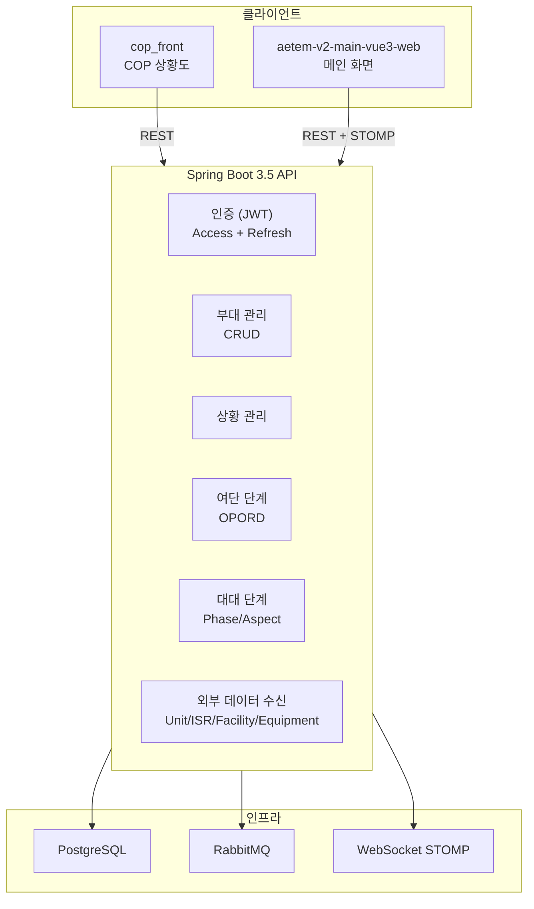
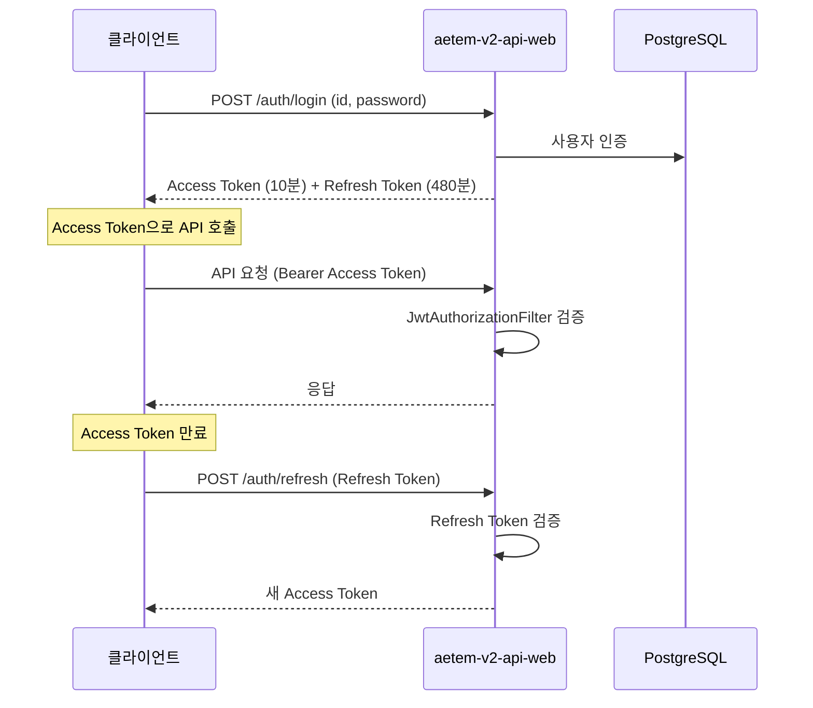
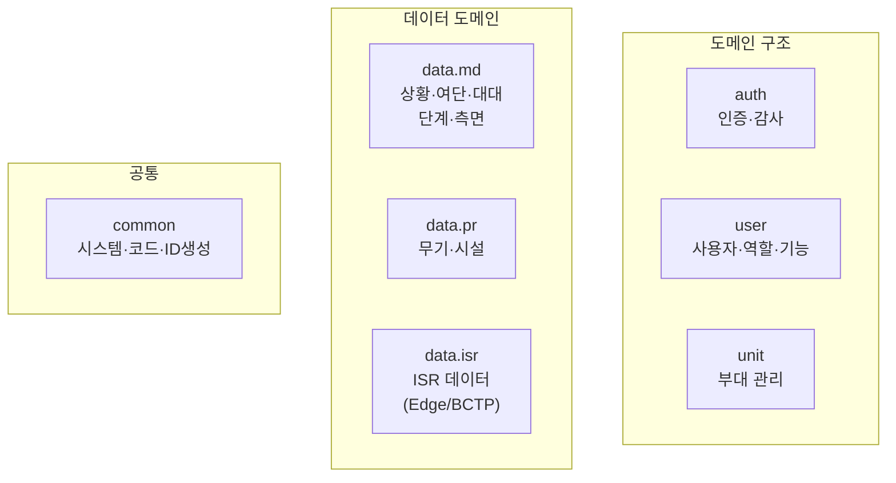

## AETEM v2 백엔드 (aetem-v2-api-web)

COP 프론트엔드의 백엔드 시스템인 aetem-v2-api-web은 Spring Boot 3.5 기반의 REST API 서버입니다.

### 기술 스택

| 분류 | 기술 |
|------|------|
| **프레임워크** | Spring Boot 3.5.11, Java 17 |
| **웹 서버** | Undertow (Tomcat 대체) |
| **보안** | Spring Security, JWT (Access 10분 + Refresh 480분) |
| **ORM** | MyBatis 3.0.3 |
| **DB** | PostgreSQL (log4jdbc 로깅) |
| **메시징** | RabbitMQ (AMQP) |
| **실시간** | WebSocket STOMP |
| **캐시** | Caffeine (max 10000, 5분 TTL) |
| **API 문서** | SpringDoc OpenAPI 2.8.15 (Swagger) |

---

## REST API 엔드포인트

### 인증 API

| 엔드포인트 | Method | 설명 |
|-----------|--------|------|
| `/apis/v1/auth/login` | POST | 로그인 (JWT Access + Refresh 발급) |
| `/apis/v1/auth/logout` | POST | 로그아웃 |
| `/apis/v1/auth/refresh` | POST | Access Token 갱신 |

### 사용자 관리

| 엔드포인트 | Method | 설명 |
|-----------|--------|------|
| `/apis/v1/user/list` | GET | 사용자 목록 |
| `/apis/v1/user/detail` | GET | 사용자 상세 |
| `/apis/v1/user/regist` | POST | 사용자 등록 |
| `/apis/v1/user/update` | PUT | 사용자 수정 |
| `/apis/v1/user/delete` | DELETE | 사용자 삭제 |
| `/apis/v1/user/checkId` | GET | ID 중복 체크 |
| `/apis/v1/user/initPassword` | PUT | 비밀번호 초기화 |
| `/apis/v1/user/existCommander` | GET | 지휘관 존재 여부 |

### 부대 관리

| 엔드포인트 | Method | 설명 |
|-----------|--------|------|
| `/apis/v1/unit/list` | GET | 부대 목록 |
| `/apis/v1/unit/detail` | GET | 부대 상세 |
| `/apis/v1/unit/regist` | POST | 부대 등록 |
| `/apis/v1/unit/update` | PUT | 부대 수정 |
| `/apis/v1/unit/delete` | DELETE | 부대 삭제 |
| `/apis/v1/unit/updateDefaultUnit` | PUT | 기본 부대 설정 |

### 작전 관리

| 엔드포인트 | Method | 설명 |
|-----------|--------|------|
| `/apis/v1/situation/situationList` | GET | 상황 목록 |
| `/apis/v1/battalion/limitBattalionPhase` | GET | 대대 단계 제한 |
| `/apis/v1/battalion/getOrb` | POST | ORB(Order of Battle) 조회 |
| `/apis/v1/battalion/getBattalionPhase` | POST | 대대 단계 조회 |
| `/apis/v1/brigade/getOpord` | POST | 작전명령(OPORD) 조회 |
| `/apis/v1/brigade/opordReception` | POST | OPORD 수신 보고 |

### 외부 데이터 수신 (Inbound)

외부 시스템(C4I)에서 데이터를 수신하는 엔드포인트입니다:

| 엔드포인트 | Method | 설명 |
|-----------|--------|------|
| `/apis/v1/inbound/manage/start` | POST | 수집 시작 |
| `/apis/v1/inbound/unit/receive` | POST | 부대 데이터 수신 |
| `/apis/v1/inbound/facility/receive` | POST | 시설 데이터 수신 |
| `/apis/v1/inbound/isr/receive` | POST | ISR 정보 수신 |
| `/apis/v1/inbound/status/receive` | POST | 상태 데이터 수신 |
| `/apis/v1/inbound/equipment/receive` | POST | 장비 데이터 수신 |
| `/apis/v1/inbound/brigade/fileUpload` | POST | 파일 업로드 |
| `/apis/v1/inbound/brigade/opordPreProCessing` | POST | OPORD 전처리 |

---

## 인증/보안

### JWT 이중 토큰

### Security 설정

| 경로 | 접근 권한 |
|------|-----------|
| `/apis/v1/auth/**` | 인증 없이 허용 |
| `/apis/v1/sample/noAuth` | 인증 없이 허용 |
| `/stomp/**` | 인증 없이 허용 |
| Swagger | 인증 없이 허용 |
| `/apis/v1/inbound/**` | `SYSTEM` 권한 (고정 토큰) |
| 그 외 | 인증 필요 |

---

## 도메인 모델

### 데이터베이스 테이블

| 도메인 | 주요 테이블 |
|--------|-----------|
| **사용자** | USER_INFO, USER_ROLE, USER_FUNCTION |
| **부대** | unit (부대 계층 구조) |
| **상황** | situation, brigade_phase, battalion_phase, battalion_aspect |
| **상태** | unit_status, unit_equipment_status, facility_status |
| **ISR** | isr_info, isr_info_file |
| **무기/시설** | Armaments, Facility |
| **공통** | Code (그룹·상세), System |

---

## 메시징 (RabbitMQ)

외부 시스템 연동에 RabbitMQ를 사용합니다:

| 항목 | 설정 |
|------|------|
| **Exchange** | ex_di.dev.business-task-request (dev) |
| **용도** | Inbound 데이터 수신 처리 |
| **프로토콜** | AMQP (5672) |

---

## 캐시 (Caffeine)

| 설정 | 값 |
|------|-----|
| **최대 크기** | 10,000 항목 |
| **만료 시간** | 5분 (access 기반) |
| **대상** | 공통 코드, 부대 목록 등 빈번 조회 데이터 |

---

## 서비스 계층 요약

| 서비스 | 역할 |
|--------|------|
| **AuthService** | JWT 발급, 로그인/로그아웃, 감사 로그 |
| **UserService** | 사용자 CRUD, 소속 부대, 지휘관 확인 |
| **UnitService** | 부대 계층 관리 |
| **SituationService** | 상황 목록 조회 |
| **BrigadePhaseService** | 여단 단계 관리 |
| **BattalionPhaseService** | 대대 단계 관리 |
| **OpordService** | 작전명령(OPORD) 처리 |
| **ArmamentsService** | 무기/장비 데이터 |
| **FacilityService** | 시설 데이터 |
| **IsrDataServiceFactory** | ISR 데이터 (Edge/BCTP 팩토리 패턴) |
| **CodeService** | 공통 코드 (그룹/상세) |
| **IdGenerateService** | 시퀀스 기반 ID 생성 |
