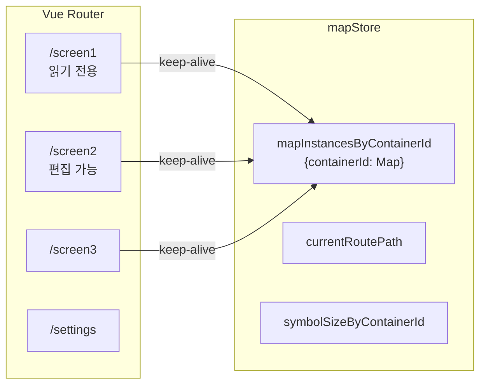
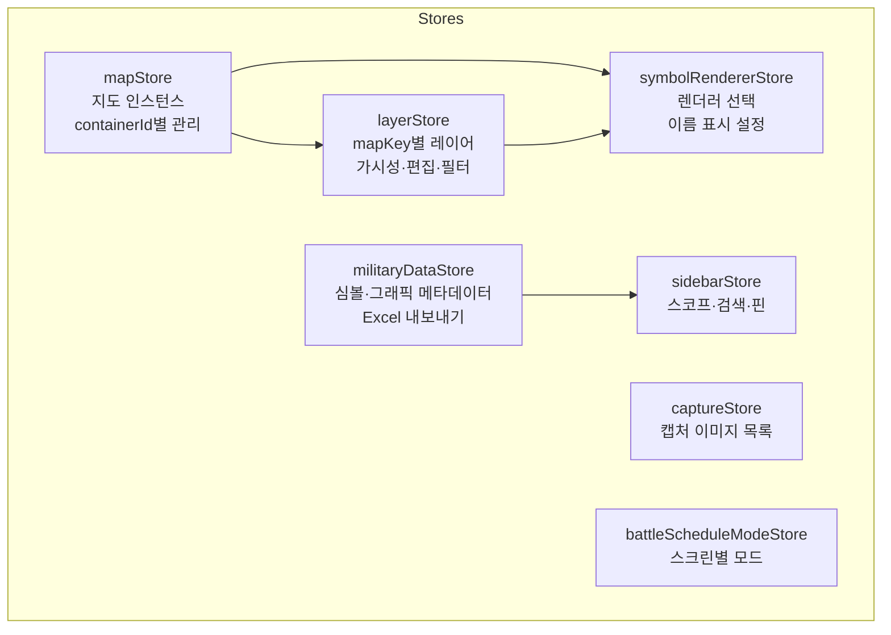
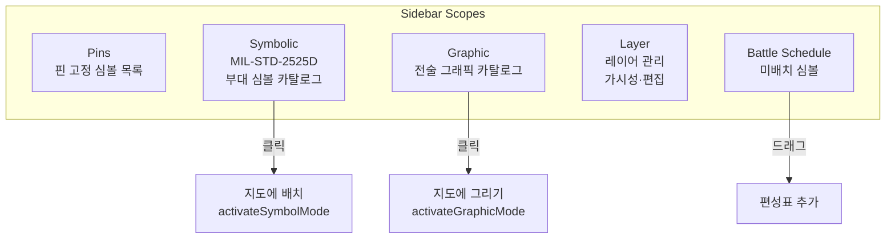
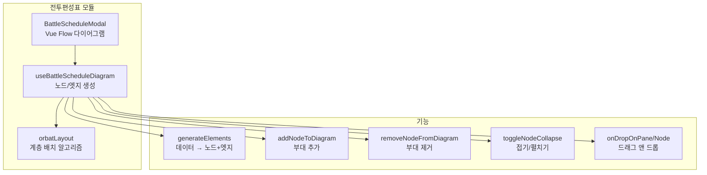

## Vue 3 + OpenLayers 기반 COP

### 기술 스택

| 분류 | 기술 | 버전 |
|------|------|------|
| **프레임워크** | Vue 3, Vite | 3.5, 7.2 |
| **상태 관리** | Pinia | 3.0 |
| **스타일** | Tailwind CSS | 4.1 |
| **지도** | OpenLayers | 10.7 |
| **군사 심볼** | milsymbol, mil-sym-ts-web, milgraphics | 3.0, 2.6, 0.0.2 |
| **공간 연산** | Turf.js, MGRS | 7.3, 2.1 |
| **다이어그램** | Vue Flow | 1.48 |
| **유틸** | D3.js, xlsx, html-to-image, Ramda | - |

---

## 멀티 맵 화면 구조

3개의 독립 맵 화면을 `keep-alive`로 캐싱하여 화면 전환 시 상태를 유지합니다.

각 화면은 `MapScreen.vue`를 사용하며, `containerId`로 OpenLayers Map 인스턴스를 독립 관리합니다.

## OpenLayers 지도 모듈

### 맵 생성

- **타일**: XYZ 타일 서버 (`VITE_TILE_LAYER_URL`), OSM OpenMapTiles
- **좌표계**: EPSG:3857
- **줌 범위**: 1~20
- **초기 중심**: `VITE_CENTER_COORDINATE` (환경 변수)
- **인터랙션**: DragRotate (Shift+드래그 회전), 기본 인터랙션

### 맵 컨트롤

- 줌 인/아웃
- 회전 초기화 (0도 복귀)
- 초기 위치 복귀

---

## MIL-STD-2525D 군사 부호 시스템

### SIDC(Symbol Identification Code) 체계

NATO MIL-STD-2525D 표준의 20~30자리 코드로 군사 부호를 식별합니다:

| 위치 | 의미 | 예시 |
|------|------|------|
| 1-2 | Version | 10 (2525D) |
| 3-4 | Standard Identity | 03 (아군) |
| 5-6 | Symbol Set | 10 (부대), 25 (전술 그래픽) |
| 7-8 | Status | 00 (현재) |
| 9-10 | HQ/Task Force/Dummy | - |
| 11-16 | Entity/Type/Subtype | - |
| 17-18 | Echelon | 12 (대대) |
| 19-20 | ... | - |

### 렌더러 이중 지원

두 가지 렌더링 엔진을 런타임에 교체할 수 있습니다:

| 렌더러 | 특징 | 용도 |
|--------|------|------|
| **mil-sym-ts-web** | 정밀 MIL-STD 규격, 미국 육군 C5ISR 공식 | 기본 렌더러, 전술 그래픽 전용 |
| **milsymbol** | 경량, 빠른 SVG 생성 | 대안 렌더러 (부대 심볼만) |

**SVG 캐시**: LRU 방식 최대 120개 캐싱으로 동일 부호 반복 렌더링 성능 최적화.

### 전술 그래픽 유형

| 카테고리 | 그래픽 | 그리기 타입 |
|---------|--------|-----------|
| **선형** | Boundary, Phase Line, FEBA | LineString (2+ points) |
| **영역** | Area of Operations, Engagement Area | Polygon (3+ points) |
| **포인트** | Fire Reference Point, Observation Post | Point |
| **원형** | Circular Target | Circle (center + radius) |
| **사각** | Rectangular Target | Rectangle (4 vertices) |

---

## 상태 관리 (Pinia)

### layerStore 상세

mapKey(route.path 또는 containerId)별로 독립적인 레이어 컨텍스트를 관리합니다:

- **layers**: 레이어 목록 (id, name, color)
- **layerVisibility / layerEditable**: 레이어별 가시성/편집 토글
- **itemVisibility / itemEditable**: 개별 아이템별 오버라이드
- **assignments**: featureId → layerIds 매핑 (assignment 모드)
- **enabledSymbols**: symbolset+code 패턴 (rule 모드)

---

## 사이드바 & 스코프 시스템

**ScopeSwitcher**: 5개 스코프(pins/symbolic/graphic/layer/battleSchedule) 전환
**검색**: 한글/영문 심볼명 검색
**핀 고정**: 자주 쓰는 심볼을 핀에 등록

---

## 인터랙션 시스템

### 지도 인터랙션

| 모드 | 동작 | 트리거 |
|------|------|--------|
| **Select** | 심볼/그래픽 선택, 정보 패널 표시 | 클릭 |
| **Draw (Point)** | 부대 심볼 배치 | 심볼 선택 후 맵 클릭 |
| **Draw (Line/Polygon)** | 전술 그래픽 그리기 + 실시간 미리보기 | 그래픽 선택 후 맵 클릭 |
| **Translate** | 선택된 심볼 드래그 이동 | 드래그 |
| **Modify** | 그래픽 꼭짓점 편집 | 선택 후 드래그 |

### 키보드 단축키

| 키 | 동작 |
|----|------|
| **Delete** | 선택된 아이템 삭제 |
| **ESC** | 현재 모드 취소 |
| **Shift + 드래그** | 지도 회전 |

---

## 전투편성표 (ORBAT) 모듈

Vue Flow 기반의 부대 편성표(Order of Battle) 다이어그램입니다.

- **커스텀 노드**: `#node-unit` 슬롯으로 군사 부호 SVG가 포함된 노드
- **커스텀 엣지**: `CenterStepEdge` (계단형 연결선)
- **계층 배치**: `layoutTree` 알고리즘으로 부모-자식 자동 정렬
- **팔레트**: 미배치 심볼을 사이드바에서 다이어그램으로 드래그 앤 드롭
- **지도 연동**: 편성표에서 심볼 클릭 시 지도에 배치 모드 활성화

---

## 지도 캡처 기능

- **Extent 캡처**: 현재 뷰포트 전체 또는 지정 영역
- **회전 스냅**: 회전된 맵도 정확하게 캡처
- **캡처 관리**: 여러 캡처를 리스트로 관리, 삭제, 전체 삭제

---

## 환경 변수 설정

| 변수 | 용도 | 예시 |
|------|------|------|
| `VITE_TILE_LAYER_URL` | 타일 서버 URL | `http://host:8001/styles/OSM/{z}/{x}/{y}.png` |
| `VITE_CENTER_COORDINATE` | 지도 초기 중심 좌표 | `[128.3881, 37.58]` |
| `VITE_SYMBOL_USAGE_INFO` | 심볼 표시 옵션 (echelon, taskForce 등) | JSON 문자열 |
