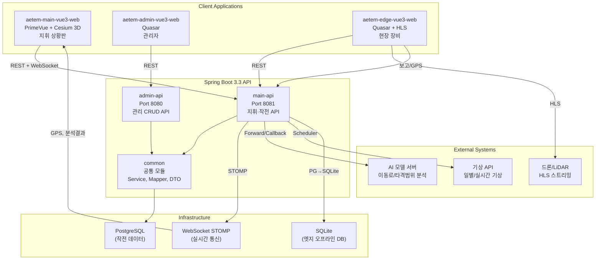
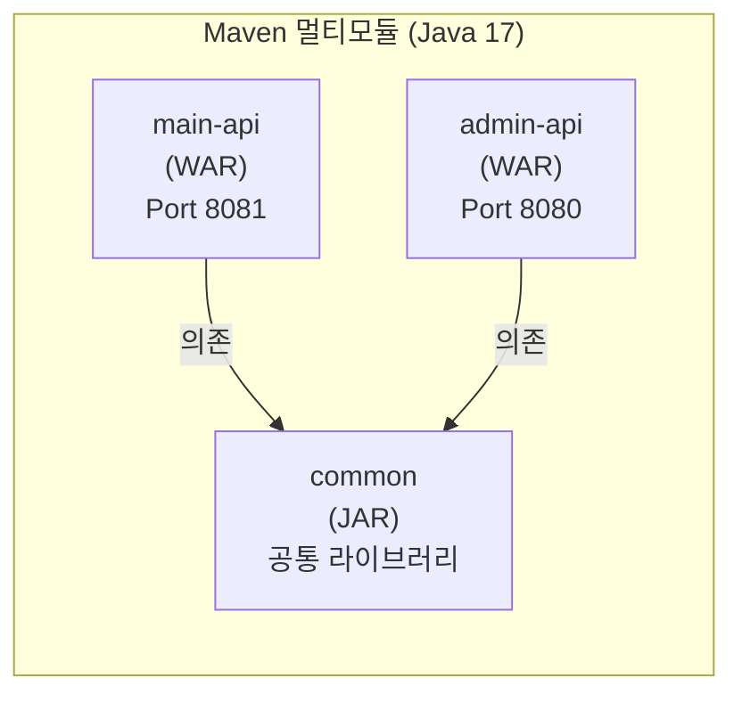
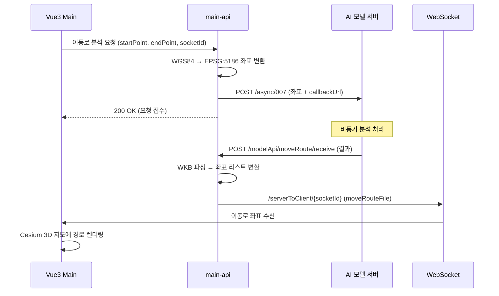

## 전체 시스템 구성

AETEM은 **3개 Vue 3 클라이언트**, **2개 Spring Boot API 서버**, **공통 라이브러리**, **AI 모델 서버**, **엣지 장비**로 구성됩니다.

## 모듈 구조

- **common**: 도메인별 Mapper, Service, DTO/VO, MapStruct, Security 기본 설정
- **main-api**: 지휘·작전용 API, WebSocket, 배치 스케줄러, AI 모델 연동
- **admin-api**: 관리 CRUD API, 초기화 필터

## AI 모델 연동 (비동기 콜백 패턴)

**타격범위 분석**도 동일한 패턴이나, 결과가 Base64 인코딩된 GeoTIFF 파일로 반환되어 래스터 오버레이로 표시됩니다.

## WebSocket STOMP 통신

| 메시지 유형 | 채널 | 발행자 | 내용 |
|------------|------|--------|------|
| `gpsInfo` | `/serverToClientAll` | main-api (Edge GPS 수신 시) | 드론/장비 실시간 GPS 위치 |
| `deviceEdgeStatus` | `/serverToClientAll` | main-api | 엣지 장비 상태 변경 |
| `moveRouteFile` | `/serverToClient/{socketId}` | main-api (AI 콜백) | 이동로 분석 결과 좌표 |
| `strikeRangeFile` | `/serverToClient/{socketId}` | main-api (AI 콜백) | 타격범위 GeoTIFF |

- **엔드포인트**: `/stomp` (SockJS)
- **브로커**: `/sub`, `/serverToClient`, `/serverToClientAll`
- **인증**: `FilterChannelInterceptor`에서 CONNECT 시 JWT 검증

## 엣지 DB 동기화 (PostgreSQL → SQLite)

Edge 장비가 오프라인 환경에서도 동작할 수 있도록 PostgreSQL 데이터를 SQLite로 변환하여 전달합니다.

- **동기화 테이블**: `user_user`, `unit_device`, `unit_force`, `common_group_code`, `common_detail_code`
- **필터링**: 해당 `deviceId`의 `unit_device`만 포함
- **전달 방식**: SQLite 파일을 바이트 배열로 API 응답에 포함

## 데이터베이스 스키마 (PostgreSQL)

| 도메인 | 테이블 | 용도 |
|--------|--------|------|
| **USER** | `user_user` | 사용자 (user_auth: M/E/A) |
| **UNIT** | `unit_force` | 부대 (편제부호, 적아구분, 병과) |
| | `unit_weapon`, `unit_weapon_detail` | 무기 및 부대별 무기 배치 |
| | `unit_device`, `unit_device_detail` | 엣지 장비 및 배치 |
| **SITUATION** | `situation_situation` | 작전 국면 |
| | `situation_situation_detail` | 국면별 부대 배치 (편제부호, 좌표) |
| | `situation_order` | 작전 지시 |
| | `situation_report` | 보고 (적, 환경) |
| | `situation_strategy` | 방책 |
| **SETTING** | `setting_weather_set` | 기상셋 |
| | `setting_environment` | 환경정보 (GeoTIFF) |
| | `setting_template` | 맵 템플릿 |
| | `setting_map_object` | 3D 지도 오브젝트 (경계, 영역, 포인트) |
| | `setting_base_plan` | 기본 작전 계획 |
| | `setting_operating_unit` | 운영 주체 |
| **EDGE** | `edge_device_gps_info` | 장비 GPS 이력 (위경도, MGRS) |
| **COMMON** | `common_group_code`, `common_detail_code` | 공통 코드 |
| | `common_military_symbol` | 편제부호 아이콘 |
| **SYSTEM** | `system_file` | 파일 메타 |
| | `system_weather_info` | 기상 데이터 |

## 인증/보안

- **JWT**: HS256, 유효기간 30일
- **권한 체계**: `M`(Main 지휘관), `E`(Edge 현장), `A`(Admin 관리자)
- **main-api**: `/aetem/main/**` → `hasAuthority("M")`, Edge API도 M 권한 필요
- **admin-api**: `/aetem/admin/**` → `hasAuthority("A")`
- **필터 체인**: `JwtAuthorizationFilter` → Bearer 토큰 파싱 → UserDetailsService 인증

## 배치 스케줄러

| 작업 | 스케줄 | 내용 |
|------|--------|------|
| `dailyWeatherInsertScheduler` | 매일 01:00 | 전일 기상 API 조회 → `system_weather_info` 저장 |
| `currentWeatherTaskScheduler` | 매 10분 (비활성) | 실시간 기상 조회 |
