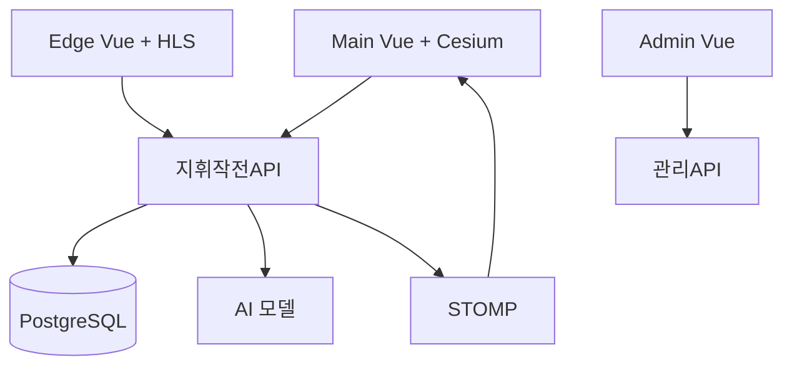

## 핵심 기술 (한 줄 요약)

**3개 Vue 3 클라이언트(지휘·관리·현장)**, **Spring Boot 3 멀티모듈(지휘용 API·관리용 API·공유 라이브러리)**, **PostgreSQL**, **WebSocket STOMP**, 외부 **AI 모델 서버**, **엣지 SQLite 동기화**로 이루어진 C4I 스택입니다.

## 기술적 도전과 해결

### Challenge: AI 분석(초~분 단위)과 실시간 지휘판의 시간 스케일 차이

**상황** — 이동로·타격범위 분석은 외부 모델 서버에서 **비동기**로 끝나고, 지휘판은 **즉시 갱신**되어야 합니다.

**문제** — 긴 HTTP 폴링으로는 UX가 나빠지고, 요청 스레드를 붙잡으면 API가 불안정해집니다.

**접근** — **요청 전달 + 비동기 콜백** 패턴으로 모델에 작업을 넘기고, 결과는 **클라이언트 세션 키 기준 실시간 푸시**로만 돌려줬습니다.

**해결** — 좌표계 변환(WGS84 ↔ 투영)·WKB/GeoTIFF 처리는 API에서 정리하고, 클라이언트는 구독 채널만 알면 됩니다.

**성과** — 분석이 길어져도 **API 가용성을 유지**하면서 Cesium 뷰는 결과 도착 즉시 반영됩니다.

### Challenge: 지훈·관리·현장(Edge)의 보안 경계

**상황** — 같은 도메인 데이터라도 **역할별 API**가 달라야 합니다.

**문제** — 한 JWT로 모든 경로가 열리면 현장 단말에서 관리 기능까지 노출될 수 있습니다.

**접근** — **지휘·작전·현장 연동 API**와 **마스터 데이터 관리 API**를 물리적으로 나누고, **공유 라이브러리 모듈**로 도메인만 공유했습니다.

**해결** — Spring Security에서 경로·권한 코드(M/E/A)를 분리해 최소 권한을 강제했습니다.

**성과** — 배포·감사 시 **“누가 어떤 API를 쓸 수 있는지”** 설명이 단순해졌습니다.

### Challenge: 엣지 오프라인과 중앙 정본(PostgreSQL) 동기화

**상황** — 현장은 네트워크가 끊겨도 **부대·코드·장비** 정보로 화면과 보고가 돌아가야 합니다.

**문제** — 엣지에 전체 DB를 내려주면 용량·유출 범위가 커집니다.

**접근** — 서버에서 **장비에 매핑된 단위만** 골라 SQLite로 내려 보내는 전용 흐름을 두었습니다.

**해결** — REST로 SQLite 바이너리를 전달하고, Edge는 로컬에서 읽기·보고를 이어갑니다.

**성과** — 오프라인에서도 **작전 연속성**을 확보하면서 데이터 노출 면적을 줄였습니다.

## 시스템 한눈에 (고수준)

## 설계 메모

- 기상·환경은 **배치 스케줄러**로 주기 갱신해 화면이 항상 “어제 데이터”에 머물지 않게 했습니다. 실시간 기상은 프로파일·스케줄로 분리해 운영 선택지를 남겼습니다.
