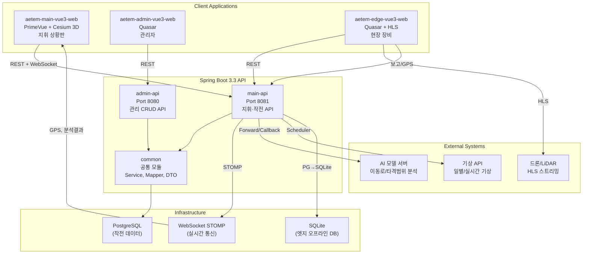
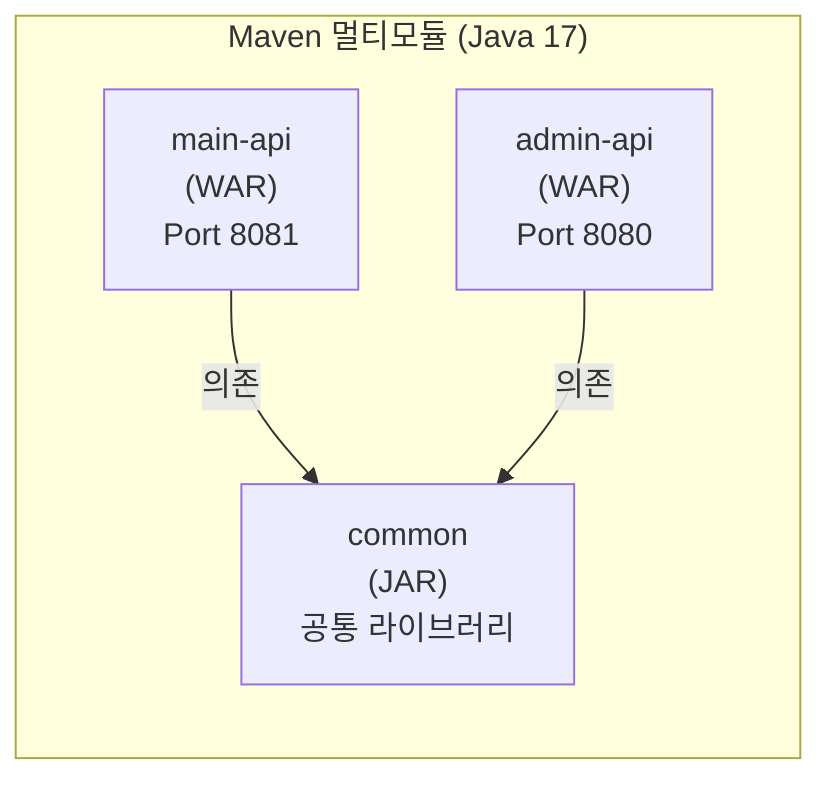
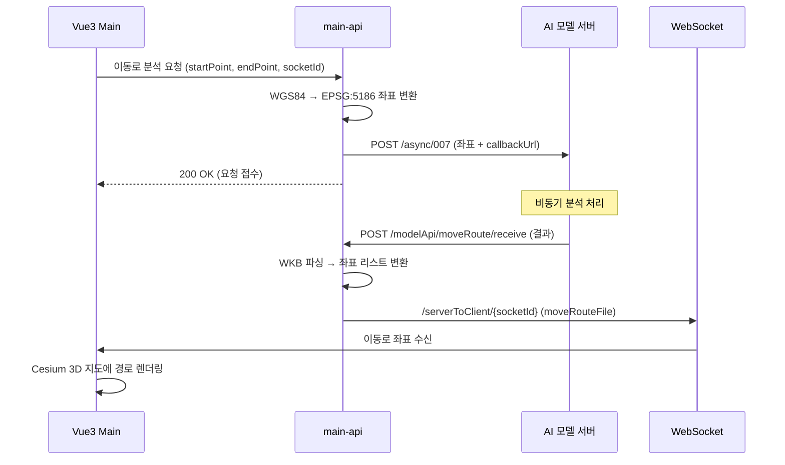

## 전체 시스템 구성

AETEM은 **3개 Vue 3 클라이언트**, **2개 Spring Boot API 서버**, **공통 라이브러리**, **AI 모델 서버**, **엣지 장비**로 구성됩니다.

## 모듈 구조

- **common**: 도메인별 Mapper, Service, DTO/VO, MapStruct, Security 기본 설정
- **main-api**: 지휘·작전용 API, WebSocket, 배치 스케줄러, AI 모델 연동
- **admin-api**: 관리 CRUD API, 초기화 필터

## AI 모델 연동 (비동기 콜백 패턴)

**타격범위 분석**도 동일한 패턴이나, 결과가 Base64 인코딩된 GeoTIFF 파일로 반환되어 래스터 오버레이로 표시됩니다.

## WebSocket STOMP 통신

**요구**: 지휘 상황판은 엣지에서 올라오는 GPS·장비 상태를 지연 없이 보여야 하고, AI 분석은 수 초~수 분 걸려 HTTP 응답 하나에 담기 어렵습니다. 사용자별로 이동로·타격범위 결과를 나눠 푸시해야 합니다.

**선택**: SockJS 기반 STOMP로 브라우저 호환성과 연결 유지를 맞추고, 전역 브로드캐스트(전 장비 위치 등)와 소켓 ID 기반 개인 채널(AI 결과)을 함께 씁니다. 연결 시 JWT를 검증해 구독 권한을 통일합니다.

**과정·결과**: Edge가 REST로 올린 GPS는 전체 구독자에게, AI 콜백으로 들어온 경로·래스터는 요청을 낸 클라이언트에만 전달되어 Cesium 상황도가 실시간으로 갱신됩니다.

## 엣지 DB 동기화 (PostgreSQL → SQLite)

**요구**: 현장 엣지는 네트워크가 끊겨도 최소한의 부대·장비·코드 정보로 화면을 돌려야 합니다.

**선택**: 서버의 정본(PostgreSQL)에서 엣지에 필요한 부분만 골라 SQLite 파일로 만들어 API 응답에 실어 보냅니다. 해당 장비에 매핑된 단위만 넣어 용량과 민감 범위를 줄입니다.

**결과**: 온라인일 때는 중앙 데이터와 동기화하고, 오프라인에서도 읽기·보고 흐름이 끊기지 않습니다.

## 영구 데이터(PostgreSQL)의 역할

관계형 DB에는 **사용자·부대·장비·작전 국면·지시·보고·환경/기상·3D 맵 설정·파일 메타** 등 지휘 시스템의 정합성이 필요한 데이터가 모입니다. 도메인이 나뉘어 있지만 포트폴리오 아키텍처 설명에서는 “작전 상황을 뒷받침하는 단일 정본”으로 두고, 세부 테이블 목록은 생략합니다.

## 인증/보안

**요구**: 지휘(Main)·현장(Edge)·관리(Admin)가 같은 API를 쓰면 안 되므로 역할을 명확히 나눠야 합니다.

**선택**: JWT로 무상태 인증을 유지하고, main-api와 admin-api 경로별로 권한을 분리했습니다. Edge API도 지휘 권한 체계 안에서만 동작하도록 묶었습니다.

**결과**: UI 종류(메인/엣지/관리)에 맞는 최소 권한만 노출되어 운영·감사에 유리합니다.

## 배치 스케줄러

**요구**: 작전 화면의 기상·환경 레이어는 매일 갱신된 값이 있어야 합니다.

**선택·결과**: 정해진 시각에 기상 API를 조회해 DB에 적재하는 배치를 두어, 사용자가 수동으로 갱신하지 않아도 전일 기준 데이터가 준비됩니다. 실시간 기상은 필요 시 활성화할 수 있도록 별도 작업으로 두었습니다.
