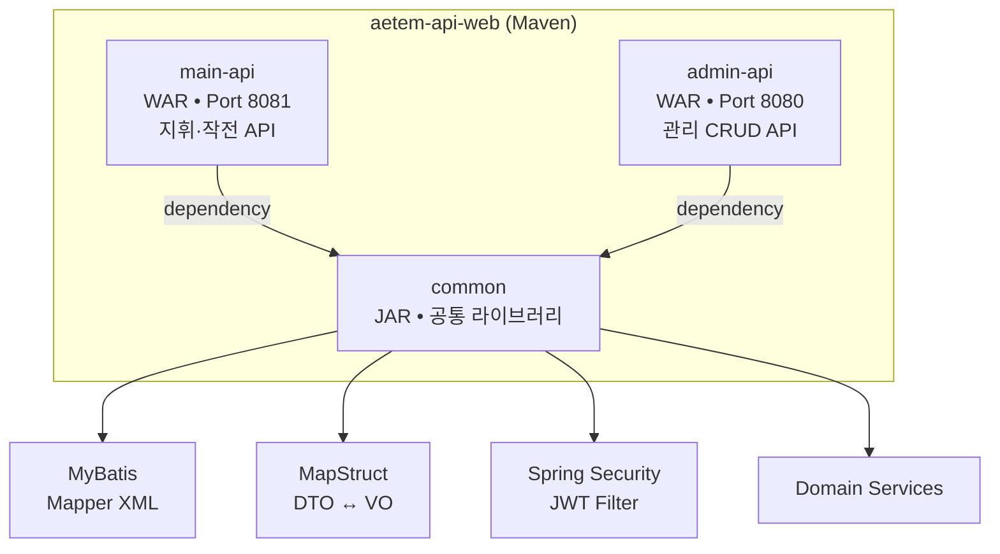
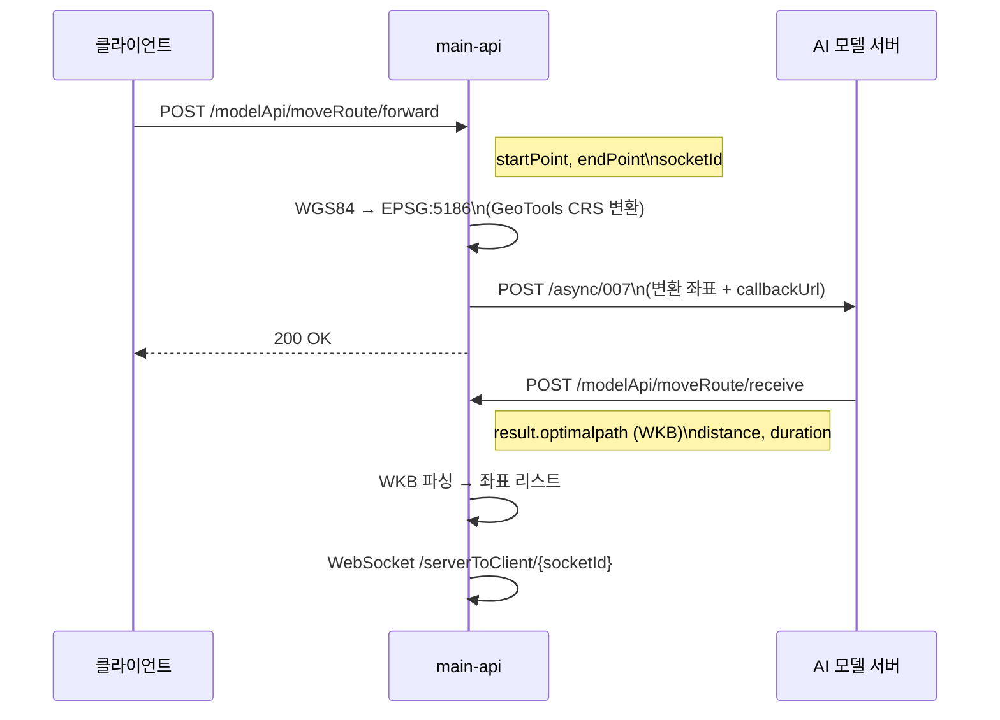
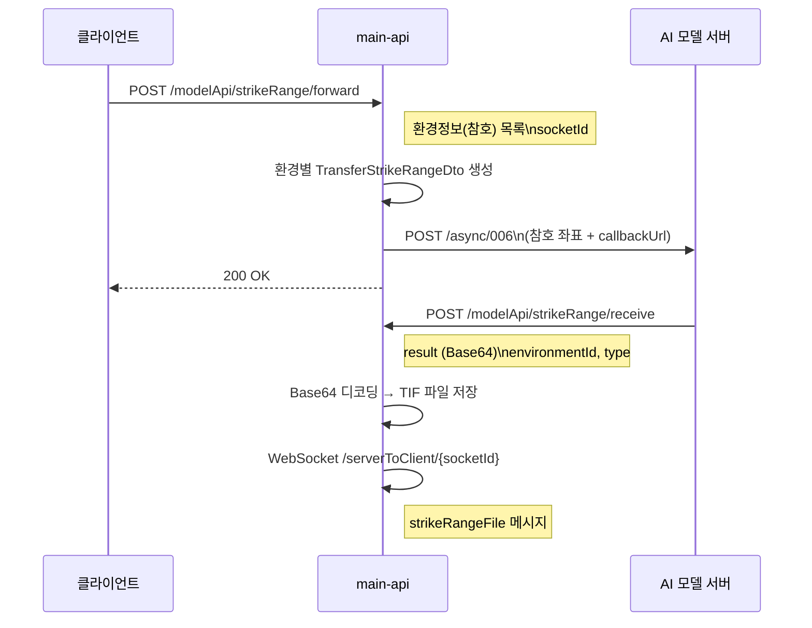
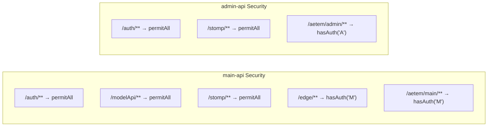
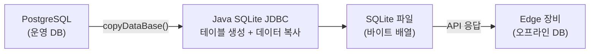

## Spring Boot 3 멀티모듈 구조

- **common**: 모든 도메인(User, Unit, Situation, Setting, System, Edge)의 Mapper, Service, DTO/VO, MapStruct 인터페이스 포함
- **main-api**: 지휘·작전용 REST API + WebSocket STOMP + 배치 스케줄러 + AI 모델 연동
- **admin-api**: 관리 CRUD REST API + `AetemInitializeFilter`

## 주요 REST API

### Main API (`/aetem/main`)

| 도메인 | 엔드포인트 | Method | 설명 |
|--------|-----------|--------|------|
| **인증** | `/auth/login` | POST | JWT 로그인 |
| **국면** | `/situations` | POST, GET | 국면 생성, 목록 조회 |
| | `/situations/{id}` | GET, PATCH, DELETE | 국면 상세, 수정, 삭제 |
| | `/situations/{id}/apply` | PATCH | 국면 적용 (지도에 반영) |
| | `/situations/apply` | GET | 현재 적용 국면 조회 |
| **보고** | `/emergencies/reports` | GET, POST | 보고 목록, 생성 (MultipartFile 첨부) |
| | `/emergencies/reports/{id}` | GET | 보고 상세 |
| **지시** | `/emergencies/orders` | GET | 지시 목록 |
| | `/emergencies/orders/{id}` | GET | 지시 상세 |
| **AI 분석** | `/modelApi/moveRoute/forward` | POST | 이동로 분석 요청 |
| | `/modelApi/moveRoute/receive` | POST | 이동로 분석 결과 수신 (콜백) |
| | `/modelApi/strikeRange/forward` | POST | 타격범위 분석 요청 |
| | `/modelApi/strikeRange/receive` | POST | 타격범위 분석 결과 수신 (콜백) |
| **엣지** | `/edge/createEdgeDeviceGps` | POST | GPS 저장 + WebSocket 전송 |
| | `/edge/copyDataBase` | POST | PG→SQLite 변환 전달 |
| | `/edge/getDeviceEdgeInfo` | GET | 엣지 장비 목록 |
| | `/edge/checkDeviceEdgeStatus` | PATCH | 장비 상태 갱신 |
| **부대** | `/units/forces/{id}/essential` | GET | 부대 상세 |
| | `/units/forces/{id}/weapons` | GET | 부대 무기 목록 |
| **설정** | `/setting/template` | GET | 맵 템플릿 |
| | `/setting/map/object` | GET | 지도 오브젝트 |
| | `/setting/weapons` | GET | 무기 목록 |
| | `/setting/devices` | GET | 장비 목록 |
| | `/setting/keyTerrain` | GET | 핵심 지형 |
| | `/setting/weather-set` | GET | 기상셋 |
| **환경** | `/environment/weathers/{month}` | GET | 월별 기상 평균 |

### Admin API (`/aetem/admin`)

| 도메인 | 주요 기능 | Method |
|--------|-----------|--------|
| **사용자** | CRUD, 중복체크, 비밀번호 초기화, Edge 권한 | GET, POST, PATCH, DELETE |
| **부대** | 부대 CRUD | GET, POST, PATCH, DELETE |
| **무기** | 무기 CRUD, 부대별 무기 배치 | GET, POST, PATCH, DELETE |
| **장비** | 엣지 장비 CRUD, 보고/GPS 이력 | GET, POST, PATCH, DELETE |
| **국면** | 국면 목록, 사용여부 변경 | GET, PATCH, DELETE |
| **기상** | 기상셋 CRUD, 기상코드 CRUD | GET, POST, PATCH, DELETE |
| **환경** | 환경정보 CRUD (GeoTIFF 첨부) | GET, POST, PATCH, DELETE |
| **템플릿** | 맵 템플릿 CRUD | GET, POST, PATCH, DELETE |
| **지도 오브젝트** | 맵 오브젝트 저장/조회 | GET, POST |
| **기본 계획** | 작전 기본계획 CRUD, 적용 | GET, POST, PATCH, DELETE |
| **운영주체** | 운영주체 CRUD | GET, POST, PATCH |
| **편제부호** | 군사 부호 아이콘 CRUD | GET, POST, PATCH, DELETE |
| **공통코드** | 그룹코드, 상세코드 CRUD | GET, POST, PATCH, DELETE |
| **보고/지시** | 보고 CRUD (MultipartFile), 지시 CRUD | GET, POST, PATCH, DELETE |

## AI 모델 API 연동

### 이동로 분석 (moveRoute)

### 타격범위 분석 (strikeRange)

## 인증/보안

### Spring Security 설정

### JWT 처리 흐름

1. 로그인 → `AuthService.login()` → JWT 발급 (HS256, 유효기간 30일)
2. 요청 시 → `JwtAuthorizationFilter` → `Authorization: Bearer {token}` 파싱
3. 토큰 검증 → `JwtService.getSubject()` → `UserDetailsService` 인증 객체 설정
4. 만료/유효하지 않음 → 401 JSON 응답

### 권한 체계

| 권한 코드 | 역할 | 접근 범위 |
|----------|------|-----------|
| `M` | Main (지휘관) | 지휘 API + Edge API |
| `E` | Edge (현장) | 엣지 전용 기능 |
| `A` | Admin (관리자) | 관리 CRUD API |

## 데이터 접근 계층

### MapStruct DTO-VO 변환

계층 간 타입 안전한 데이터 변환을 MapStruct로 자동 생성합니다:

| MapStruct | 변환 대상 |
|-----------|----------|
| UserMapstruct | 사용자 CRUD DTO ↔ VO |
| UnitMapstruct | 부대 CRUD DTO ↔ VO |
| SituationMapstruct | 국면 CRUD DTO ↔ VO |
| ReportMapstruct | 보고 DTO ↔ VO |
| OrderMapstruct | 지시 DTO ↔ VO |
| WeatherSetMapstruct | 기상셋 DTO ↔ VO |
| MapObjectMapstruct | 지도 오브젝트 DTO ↔ VO |
| GpsMapstruct | GPS DTO ↔ VO |
| EnvironmentMapstruct | 환경 DTO ↔ VO |
| ... (20+ Mappers) | 전체 도메인 커버 |

### MyBatis Mapper

도메인별 XML Mapper로 SQL을 관리합니다:
- `resources/mybatis/mapper/domain/user/` - 사용자
- `resources/mybatis/mapper/domain/unit/` - 부대, 무기, 장비
- `resources/mybatis/mapper/domain/situation/` - 국면, 보고, 지시, 방책
- `resources/mybatis/mapper/domain/setting/` - 기상, 환경, 템플릿, 지도, 계획
- `resources/mybatis/mapper/domain/system/` - 파일, 기상정보

## 엣지 DB 동기화

PostgreSQL → SQLite 변환 로직:

**변환 대상 테이블:**
- `user_user`: 사용자 정보
- `unit_device`: 장비 정보 (해당 deviceId만 필터링)
- `unit_force`: 부대 정보
- `common_group_code`, `common_detail_code`: 공통 코드

## WebSocket STOMP

### 설정

- **엔드포인트**: `/stomp` (SockJS 폴백)
- **메시지 크기**: 최대 50MB
- **브로커 채널**: `/sub`, `/serverToClient`, `/serverToClientAll`
- **인증**: `FilterChannelInterceptor` → CONNECT 시 JWT 검증

### GPS 전송 흐름

1. Edge 장비 → `POST /edge/createEdgeDeviceGps` (위경도)
2. `GpsService` → 위경도를 MGRS 좌표로 변환
3. `edge_device_gps_info` 테이블에 저장
4. `/serverToClientAll`로 `gpsInfo` 메시지 브로드캐스트
5. Main 클라이언트 → Cesium 3D 지도에 드론 위치 업데이트

## 배치 스케줄러

| 작업 | Cron | 스레드 풀 | 프로파일 |
|------|------|-----------|---------|
| `dailyWeatherInsert` | 매일 01:00 | 1 | `!local` |
| `currentWeatherTask` | 매 10분 (비활성) | 2 | `!local` |

- **기상 데이터 수집**: 외부 기상 API 호출 → `system_weather_info` 저장
- **지역**: 운영 지역 기상 (풍속, 기온, 습도 등)

## 캐시 (Ehcache)

Ehcache 3.10.8로 반복 조회 데이터를 캐싱합니다:
- 공통 코드 (그룹코드, 상세코드)
- 부대 목록
- 기상 데이터

## API 문서 (SpringDoc OpenAPI)

- **main-api**: `http://localhost:8081/swagger-ui.html`
- **admin-api**: `http://localhost:8080/swagger-ui.html`
- Swagger YAML은 `document/swagger/` 디렉터리에서 관리
