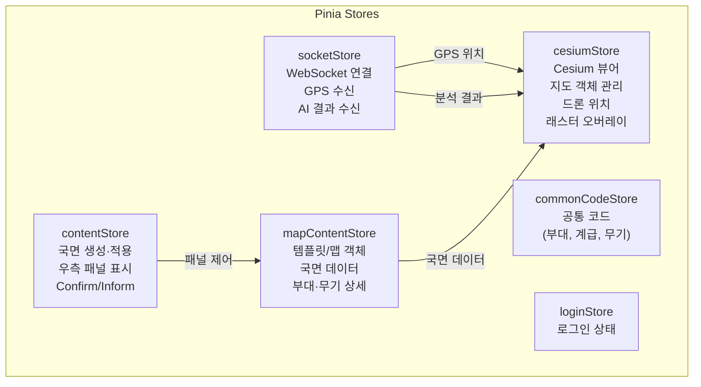
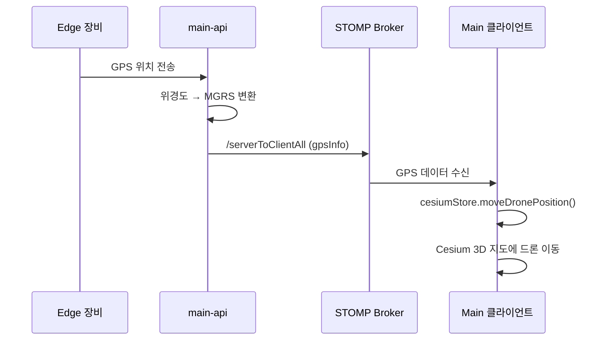

## 3개 Vue 3 클라이언트

AETEM은 **역할별로 분리된 3개의 Vue 3 클라이언트**를 사용합니다.

| 클라이언트 | UI 프레임워크 | 역할 | 핵심 기능 |
|-----------|-------------|------|-----------|
| **Main** | PrimeVue 4 + Cesium | 지휘 상황판 | 3D 지도, 국면 관리, AI 분석 |
| **Admin** | Quasar 2 | 관리자 | 마스터 데이터 CRUD |
| **Edge** | Quasar 2 + HLS.js | 현장 장비 | 드론 운용, 영상, 보고 |

---

## Main 클라이언트 (지휘 상황판)

### Cesium 3D 지도 통합

Cesium Ion 기반의 3D 지구 위에 군사 객체를 렌더링합니다.

**초기화 구성:**
- **지형**: Cesium World Terrain (Ion Asset)
- **위성 타일**: Google Maps Satellite Provider
- **초기 뷰**: 한반도 중심 좌표

**줌 레벨별 표시:**
- Level 0 (120만m): 전략 수준 개요
- Level 1 (30만m): 작전 수준
- Level 2 (5만m): 전술 수준
- Level 3 (1.5만m): 부대 상세

### 군사 객체 렌더링

3D 지도에 다양한 군사 객체를 표시합니다:

| 객체 타입 | 설명 | 렌더링 방식 |
|----------|------|-----------|
| **TROOP** | 부대 편제부호 | SVG 아이콘 (Billboard) |
| **POSITION** | 진지 | Polygon |
| **BOUNDARY** | 경계선 | Polyline |
| **AREA / AREA_POINT** | 작전 영역 | Polygon + Label |
| **KEY_TERRAIN** | 핵심 지형 | Polygon |
| **FIRE_REFERENCE_POINT** | 화력참조점 | Point |
| **RECON_TEAM** | 정찰반 | Billboard |
| **PLAN_UNIT** | 방책 부대 | Billboard |

### 편제부호(Military Symbol) 렌더링

부대를 NATO APP-6 기반 편제부호 SVG로 표시합니다:
- **경로 규칙**: `{IMG_URL}/militarySymbol/{iffType}{unitLevel}{branch}.svg`
- **IFF Type**: `00`(아군/청색), `01`(적군/적색)
- **Unit Level**: 중대, 대대, 여단 등
- **Branch**: 보병, 전차, 포병, 통신 등

### 상태 관리 (Pinia)



### 주요 UI 구성

**좌측 바:**
- 작전 타이머 (국면 경과 시간)
- 사용자 정보

**우측 패널 (Right Panel):**
- **UnitSection**: 부대 상세 정보 (편제, 무기, 장비)
- **Phase**: 국면 목록 및 상태
- **Plan**: 방책 관리
- **MissionInfo**: 임무 정보
- **EmergencyInfomation**: 보고/지시 목록
- **EdgeOperation**: 엣지 장비 운용 상태
- **AnalysisView**: AI 분석 결과 표시
- **FirePlanDialog**: 화력 계획

### WebSocket 실시간 통신



---

## Admin 클라이언트 (관리 시스템)

### Quasar 기반 관리 페이지

모든 마스터 데이터에 대한 CRUD 화면을 제공합니다.

**관리 엔티티:**

| 카테고리 | 페이지 | 주요 기능 |
|---------|--------|-----------|
| **긴급** | 보고(Reports), 지시(Orders) | 생성/조회/수정/삭제 |
| **국면** | 모의(Imitation), 운영(Operate) | 국면 시나리오 관리 |
| **부대** | 부대(Forces) | 편제부호, 적아구분, 병과 설정 |
| **무기** | 무기(Weapons) | 무기 종류, 카테고리 관리 |
| **환경** | 기상셋(Weathers), 템플릿, 환경(Environment) | GeoTIFF, 지형 환경 |
| **장비** | 엣지 장비(Devices) | 드론/LiDAR 장비 등록 |
| **공통** | 사용자, 기상코드, 병과, SOP, 운영주체 | 기초 데이터 |

### 공통 컴포넌트

- **TableList**: 범용 테이블 (검색, 페이지네이션, 정렬)
- **EditableTable**: 인라인 편집 가능 테이블
- **PageTitle**: 페이지 제목 + 브레드크럼
- **ModalForCreate**: 생성 모달 폼

---

## Edge 클라이언트 (현장 장비)

### HLS 실시간 영상 스트리밍

드론의 EO(전자광학)/IR(적외선) 카메라 영상을 HLS 프로토콜로 실시간 시청합니다.


- **HLS 라이브러리**: hls.js (비 Safari), 네이티브 HLS (Safari)
- **스트림 URL**: `{HLS_URL}/eo/index.m3u8` (전자광학), `{HLS_URL}/ir/index.m3u8` (적외선)
- **생명주기**: 정찰 시작 → `playVideo()` → 정찰 종료 → `destroy()`

### 장비 운용 기능

| 장비 | 기능 | API |
|------|------|-----|
| **드론** | 정찰 시작/종료 | `/scout/drone/{key}/start`, `/end` |
| **LiDAR** | 수집 시작/종료/취소 | `/scout/lidar/{key}/start`, `/end`, `/cancel` |

### 보고 작성

현장에서 직접 적 보고 / 환경 보고를 작성합니다:

- **적 보고(Enemy Report)**: 시간, 위치(MGRS), 규모, 부대식별, 제대, 활동, 무기
- **환경 보고(Environment Report)**: 환경 상태 정보
- **이미지 첨부**: 드론 EO/IR 이미지 쌍 첨부

### 감지 내역 (DetectingList)

AI 추론으로 감지된 객체 목록을 표시합니다:
- EO/IR 이미지 쌍 표시
- 식별 정보 (객체 유형, 위치)
- 적 보고 / 환경 보고 바로 작성 버튼
- 선택 삭제 및 전체 초기화

---

## 기술적 특징

### MGRS 군사좌표 체계

모든 좌표를 NATO 표준 MGRS(Military Grid Reference System)로 표시합니다:
- 위경도(WGS84) → MGRS 자동 변환
- 지도 클릭, GPS 수신 시 MGRS 표시
- 프론트엔드(`mgrs` 라이브러리)와 백엔드(`MGRS 2.1.3`) 모두 변환 지원

### axios 인터셉터

```
Request: Authorization: Bearer {JWT}
Response 401: 토큰 만료 → 로그인 페이지 리다이렉트
Response 403: 권한 없음 → 에러 처리
```

### 빌드 환경

| 환경 | 변수 | 용도 |
|------|------|------|
| `VITE_API_URL` | Main/Admin API URL | REST API 호출 |
| `VITE_IMG_URL` | 이미지 서버 URL | 편제부호 SVG, 파일 |
| `VITE_HLS_URL` | HLS 스트리밍 URL | 드론 영상 (Edge만) |
