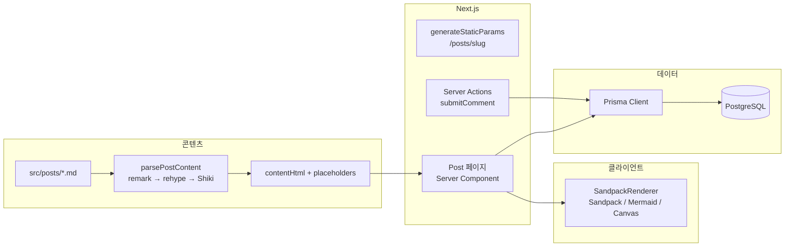

## 전체 구성

블로그는 **Next.js App Router** 한 앱 안에서 **정적 포스트 렌더링**과 **댓글용 동적 데이터 접근**을 나눕니다. 포스트 본문 HTML은 빌드·요청 시 서버에서 unified 파이프라인으로 생성되고, Sandpack·Mermaid 등은 클라이언트에서 마운트됩니다.



## Markdown 처리 흐름

1. **gray-matter**로 메타데이터와 본문을 분리합니다.
2. 본문에서 `:::sandpack`, ` ```mermaid` `, `:::component` 블록을 추출하고 임시 토큰으로 치환합니다.
3. **remark → remark-rehype → rehype-pretty-code → rehype-stringify**로 HTML을 만듭니다.
4. 토큰 위치에 **base64 인코딩된 플레이스홀더 div**를 다시 넣습니다.
5. **SandpackRenderer**가 HTML을 순회하며 Sandpack·Mermaid·등록된 React 컴포넌트로 분할 렌더링합니다.

이 방식 덕분에 MD 소스는 여전히 Git으로 버전 관리하기 쉽고, 확장 문법만 추가하면 새로운 임베드 타입을 붙일 수 있습니다.

## 댓글·데이터 계층

- **Comment** 모델: `slug`, `nickname`, `content`, `ip`, `createdAt`, 슬라이스 인덱스.
- **Server Action**에서 폼 데이터 검증 후 `addComment`, 성공 시 **`revalidatePath(`/posts/${slug}`)** 로 목록 갱신.
- 배포 환경(Vercel 등)에서는 **`x-real-ip` / `x-forwarded-for`** 를 우선해 방문자 IP를 기록합니다.

## 품질·운영

- 글에서 다루는 패턴(멱등성, 테스트 더블, MFE 이벤트 버스 등)마다 **`src/examples` + `test/`** 에 예제와 Vitest 스펙을 두어 문서와 코드가 어긋나지 않게 합니다.
- `NODE_ENV`와 `published` 필드로 **프로덕션 노출 글만 필터**하는 정책을 적용했습니다.
