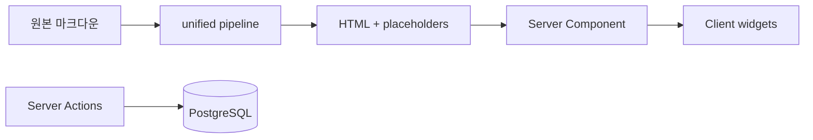

## 핵심 기술 (한 줄 요약)

**Next.js App Router** 한 앱에서 **파일 시스템 Markdown → unified(remark/rehype) 파이프라인**으로 HTML을 만들고, **Sandpack·Mermaid·커스텀 컴포넌트**는 클라이언트에서 하이드레이션합니다. 댓글은 **PostgreSQL + Prisma + Server Actions**입니다.

## 기술적 도전과 해결

### Challenge: MD 작성 경험을 유지하면서 인터랙티브 블록을 끼워 넣기

**상황** — 글은 Git으로 관리하고 싶지만 Sandpack·Mermaid·캔버스도 쓰고 싶었습니다.

**문제** — MDX로 전면 전환하면 기존 글 자산·툴링이 바뀝니다.

**접근** — **코드 샌드박스·다이어그램·삽입 컴포넌트용 확장 블록**을 **추출 → 토큰 치환 → HTML 생성 → 플레이스홀더 재주입** 순으로 처리했습니다.

**해결** — 서버에서는 HTML 문자열만 만들고, 클라이언트의 **인터랙티브 렌더러**가 플레이스홀더를 실제 위젯으로 바꿉니다.

**성과** — **작성자는 여전히 Markdown**을 쓰면서도 독자는 실행·다이어그램을 볼 수 있습니다.

### Challenge: 정적 글과 동적 댓글의 데이터 경계

**상황** — 포스트는 빌드/ISR 친화적으로 두고, 댓글은 항상 최신이어야 합니다.

**문제** — 전 페이지를 클라이언트로 가져가면 SEO·TTFB가 나빠집니다.

**접근** — 글 본문은 **Server Component**에서 Prisma로 필요한 데이터만 읽고, 댓글 폼은 Server Action으로 처리했습니다.

**해결** — **해당 경로의 서버 캐시 무효화**로 제출 직후 목록이 어긋나지 않게 했습니다.

**성과** — **첫 페인트 품질**과 **데이터 정합성**을 동시에 맞췄습니다.

### Challenge: 프로덕션 노출 vs 로컬 초안

**상황** — 작성 중 글은 로컬에서 전부 보고, 프로덕션에는 **발행 완료 플래그가 켜진 글만** 노출해야 합니다.

**문제** — 플래그 실수로 초안이 나가면 곤란합니다.

**접근** — **실행 환경(개발·프로덕션)**과 **발행 플래그**를 쿼리 계층에서 함께 필터했습니다.

**해결** — 목록·상세가 같은 규칙을 쓰도록 맞췄습니다.

**성과** — 배포 전 **검증 루프**를 단순화했습니다.

## 아키텍처 한눈에

## 설계 메모

- 글 주제별 예제·Vitest는 **예제 소스 폴더**와 테스트를 **짝지어** 문서-코드 드리프트를 줄였습니다.
