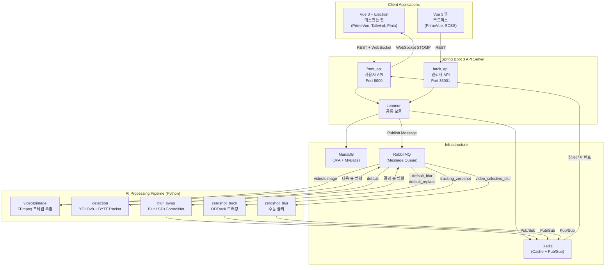
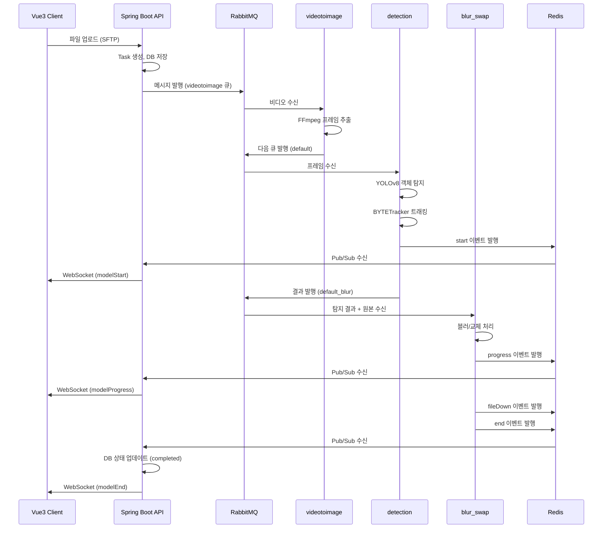
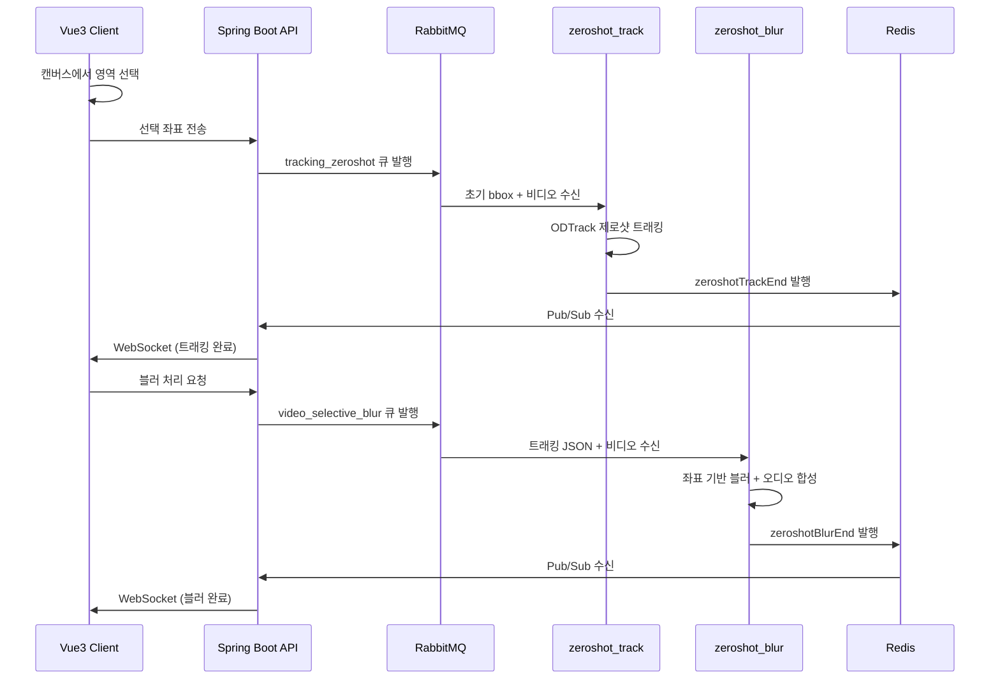

## 전체 시스템 구성

Heidi는 **프론트엔드(Vue 3 + Electron)**, **백엔드 API(Spring Boot 3)**, **AI 추론 파이프라인(Python Consumer 5개)**, **메시지 브로커(RabbitMQ)**, **캐시/Pub-Sub(Redis)**, **데이터베이스(MariaDB)**로 구성된 마이크로서비스 아키텍처입니다.



## 통신 흐름

### 1. REST API 통신

클라이언트와 서버 간 모든 데이터 요청은 JWT 인증 기반 REST API를 통해 이루어집니다.

- **인증**: `Authorization: Bearer <JWT>` 헤더
- **JWT Claims**: sub(loginId), cpIdx(회사), queueName(큐), adminYn(관리자 여부)
- **알고리즘**: HS512, 유효기간 24시간

### 2. WebSocket STOMP 실시간 통신

처리 진행률, 완료 알림 등 실시간 이벤트는 WebSocket STOMP 프로토콜로 전달됩니다.

- **엔드포인트**: `/api/stomp` (SockJS)
- **구독 경로**: `/serverToClient/{userId}` (개인), `/serverToClientAll` (전체)
- **이벤트 유형**:
  - `uploadProgress` - 파일 업로드 진행률
  - `modelProgress` - AI 처리 진행률
  - `modelStart` / `modelEnd` / `modelError` - 처리 시작/완료/에러
  - `fileDown` - 파일 다운로드 준비 완료
  - `selectiveEnd` - 수동 비식별화 완료
  - `zeroshotTrackEnd` / `zeroshotBlurEnd` - 제로샷 처리 완료
  - `logout` - 강제 로그아웃

### 3. RabbitMQ 메시지 큐

API 서버에서 AI Consumer로의 작업 전달은 RabbitMQ를 통해 비동기로 이루어집니다.

**메시지 포맷 (RabbitMessageVo)**:
```json
{
  "fileIdx": 12345,
  "video": "Y",
  "taskId": "T00041694",
  "type": "blur",
  "target": "all",
  "fileName": "video_001.mp4",
  "orgFileName": "original.mp4",
  "loginId": "user01",
  "socketId": "ws-abc123",
  "uploadPath": "/storage/upload/",
  "downloadPath": "/storage/download/",
  "queueName": "default",
  "inputSavePath": "/storage/input/video_001.mp4",
  "outputSavePath": "/storage/output/"
}
```

**큐 토폴로지**:
| Consumer | 구독 큐 | 발행 큐 |
|----------|---------|---------|
| videotoimage | `videotoimage` | 동적 (`queueName`) |
| detection | `default` | `{queue}_blur` 또는 `{queue}_replace` |
| blur_swap | `default_blur`, `default_replace` | - (Redis Pub/Sub) |
| zeroshot_track | `tracking_zeroshot` | - (Redis Pub/Sub) |
| zeroshot_blur | `video_selective_blur` | - (Redis Pub/Sub) |

### 4. Redis Pub/Sub

AI Consumer의 처리 결과와 상태는 Redis Pub/Sub를 통해 API 서버로 전달되며, API 서버가 WebSocket으로 클라이언트에 실시간 전달합니다.

**Pub/Sub 채널**:
| 채널 | 발행자 | 용도 |
|------|--------|------|
| `start` | detection | 작업 처리 시작 |
| `progress` | blur_swap | 파일 처리 진행률 |
| `end` | blur_swap | 전체 작업 완료 |
| `fileDown` | blur_swap, zeroshot_blur | 개별 파일 처리 완료 |
| `selectiveEnd` | blur_swap | 옵션 비식별화 완료 |
| `zeroshotTrackEnd` | zeroshot_track | 제로샷 트래킹 완료 |
| `zeroshotBlurEnd` | zeroshot_blur | 제로샷 블러 완료 |

**Redis Hash (상태 관리)**:
- `heidi:file:{taskId}` - 작업 상태 (totalCnt, processCnt, successCnt, failCnt, status, progress)
- `heidi:login:{sessionId}` - WebSocket 세션 정보 (userId, cpIdx)
- TTL: 작업 상태 86,400초, 세션 2,592,000초

## 파이프라인 흐름

### 자동 비식별화 파이프라인



### 선택적(수동) 비식별화 파이프라인



## 인프라 구성

- **MariaDB**: 사용자, 회사, 작업, 파일 메타데이터 영구 저장
- **Redis**: 실시간 상태 관리 (Hash), 이벤트 전달 (Pub/Sub), 캐시 (@Cacheable)
- **RabbitMQ**: AI Consumer 간 비동기 작업 분배, Durable 큐, Persistent 메시지
- **Docker**: 각 Python Consumer를 독립 컨테이너로 배포 (nvidia/cuda 베이스)
- **Prometheus + Micrometer**: Spring Boot 애플리케이션 메트릭 모니터링

## 데이터베이스 스키마 (주요 테이블)

| 테이블 | 용도 | 주요 필드 |
|--------|------|-----------|
| `user` | 사용자 정보 | user_idx, cp_idx, user_id, password, admin_yn |
| `company` | 회사(테넌트) | cp_idx, cp_name, model_idx, use_yn |
| `model` | AI 모델/큐 매핑 | model_idx, model_name, queue_name |
| `task` | 처리 작업 | task_id, status, file_cnt, success_cnt, time_taken |
| `task_detail` | 작업 상세 옵션 | task_id, data_type, model_option, target |
| `model_filelist` | 개별 파일 처리 상태 | file_idx, task_id, status, face_object, plate_object |
| `model_filelist_manual` | 수동 비식별화 데이터 | file_idx, 좌표 정보 |
| `notice` | 공지사항 | notice_idx, title, contents |
| `websocket_hist` | WebSocket 접속 이력 | user_id, socket_id, in_out |

**작업 상태(status)**: `wait` → `basic` → `progress` → `completed` / `cancel`
