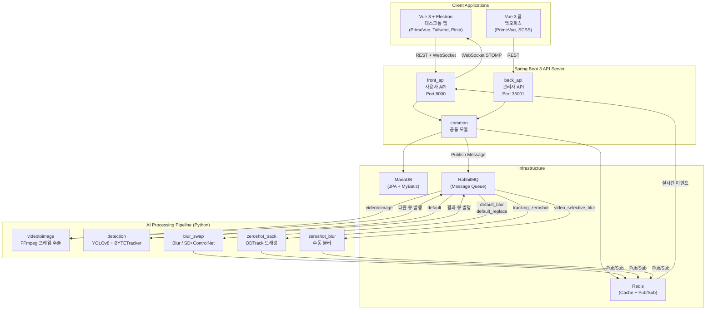
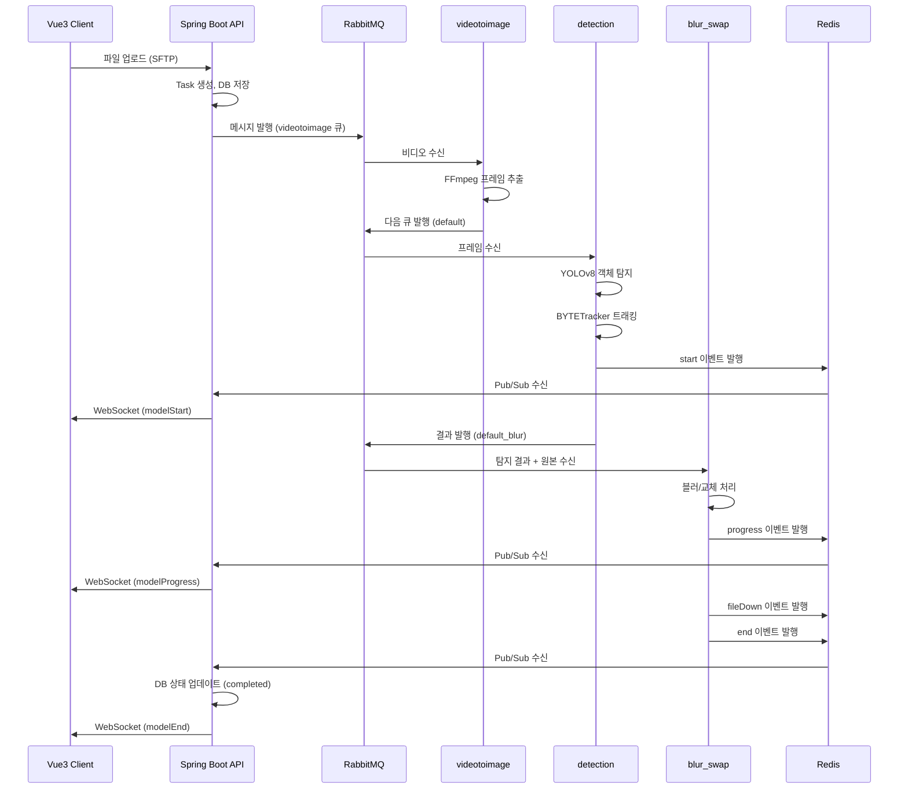
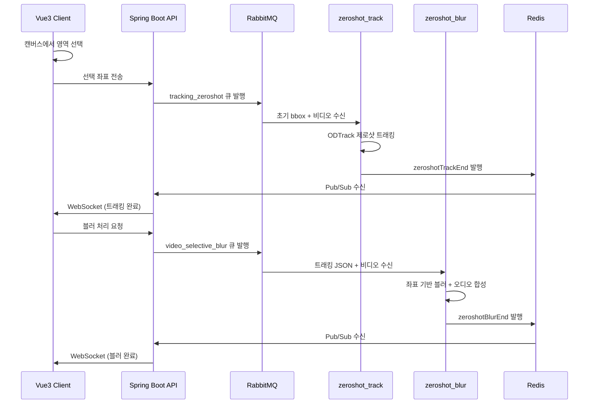

## 전체 시스템 구성

Heidi는 **프론트엔드(Vue 3 + Electron)**, **백엔드 API(Spring Boot 3)**, **AI 추론 파이프라인(Python Consumer 5개)**, **메시지 브로커(RabbitMQ)**, **캐시/Pub-Sub(Redis)**, **데이터베이스(MariaDB)**로 구성된 마이크로서비스 아키텍처입니다.

## 통신 흐름

### 1. REST API 통신

**요구**: 로그인·작업 생성·파일 메타·대시보드 등은 요청–응답이 명확한 HTTP가 적합하고, 상태 변경은 서버가 권한과 테넌트 경계를 검증해야 합니다.

**선택**: JWT 기반 무상태 API로 인증을 통일했습니다. 토큰에 로그인 식별자와 회사(테넌트), 해당 회사에 매핑된 AI 처리 큐 이름 등을 담아, 이후 REST와 WebSocket 모두에서 동일한 보안 맥락을 쓰도록 했습니다.

**결과**: 멀티테넌트 SaaS에서 회사별 격리와 API 게이트웨이 역할을 단순화하고, Electron·웹 클라이언트가 같은 규칙으로 서버와 통신할 수 있습니다.

### 2. WebSocket STOMP 실시간 통신

**요구**: AI 비식별화는 수 분~수십 분이 걸릴 수 있어, 폴링만으로는 진행률·완료·오류를 자연스럽게 보여주기 어렵습니다. 업로드 진행, 단계별 모델 처리, 다운로드 준비, 수동·제로샷 편집 완료까지 **끊김 없는 피드백**이 필요했습니다.

**선택**: 브라우저·Electron 환경에서 방화벽 친화적인 **SockJS** 위에 **STOMP**를 올려, 구독 경로와 메시지 타입을 정리된 형태로 주고받게 했습니다. 연결 시점에 JWT를 검증해 사용자별 채널로만 이벤트가 가도록 했습니다.

**과정**: 백엔드는 Redis에서 올라온 처리 이벤트를 받아 STOMP로 클라이언트에 푸시합니다. 아래 파이프라인 시퀀스 다이어그램의 `WebSocket` 단계가 그 연결 고리입니다.

**결과**: 작업 화면에서 진행률·완료·에러·강제 로그아웃 등을 실시간으로 반영해, 장시간 배치 작업의 체감 품질과 운영 대응(중복 로그인 처리 등)을 동시에 맞출 수 있습니다.

### 3. RabbitMQ 메시지 큐

**요구**: Spring API와 Python 추론 워커는 **언어·프로세스·배포 단위가 다릅니다**. 동기 HTTP로 워커를 직접 호출하면 API 타임아웃·재시도 정책이 복잡해지고, GPU 워커 장애 시 요청이 함께 쌓입니다. 또한 **비디오 → 프레임 → 탐지 → 블러/교체**처럼 단계가 나뉘어 각 단계를 독립적으로 스케일하고 싶었습니다.

**선택**: 작업 단위를 메시지로 넣고, 단계별 큐로 Consumer를 나눴습니다. 회사(모델)마다 다른 큐 이름으로 라우팅해 테넌트별 처리 대역을 분리하고, durable 큐와 영속 메시지로 브로커 재시작 이후에도 미처리 작업을 잃지 않도록 했습니다.

**과정**: API는 업로드·작업 승인 후 첫 단계(예: 비디오 분할) 큐에 발행하고, 각 Python Consumer는 자신의 큐만 소비한 뒤 다음 단계 큐로 넘깁니다. 큐 간 연결 관계는 상단 전체 구성도와 아래 시퀀스에 요약되어 있습니다.

**결과**: API 응답 시간과 무관하게 긴 추론 파이프라인을 백그라운드로 돌리고, Consumer만 수평 확장해 처리량을 조정할 수 있습니다.

### 4. Redis Pub/Sub (및 실시간 상태)

**요구**: 다수의 Python 프로세스가 처리 중간·완료 시점마다 Spring API를 각각 HTTP로 두드리면, API에 콜백 엔드포인트 난립·인증·부하 분산이 번거롭고 Consumer와 API가 강하게 결합됩니다.

**선택**: Consumer는 **가벼운 Pub/Sub 메시지**로 진행·완료·파일 단위 결과를 Redis에 발행하고, API 쪽에서는 **단일 구독 지점**에서 이를 모아 같은 서버의 WebSocket 브로커로 넘깁니다. 작업 단위 집계(처리 건수·진행률)는 Redis Hash에 잠시 두고 TTL로 정리해, DB를 매 이벤트마다 두드리지 않도록 했습니다.

**과정**: 탐지 시작·프레임/파일 처리 진행·작업 종료·수동·제로샷 완료 등은 모두 이 경로를 타고 사용자 화면까지 이어집니다.

**결과**: Python 워커 추가·재배포 시 API 계약을 최소로 유지하면서도, 실시간 UI와 배치 진행 상태를 일관되게 유지할 수 있습니다.

## 파이프라인 흐름

### 자동 비식별화 파이프라인

### 선택적(수동) 비식별화 파이프라인

## 인프라 구성

- **MariaDB**: 사용자·회사·작업·파일 메타 등 **영구 비즈니스 데이터** 저장. 실시간 이벤트와 분리해 일관된 감사·리포트 기준을 둡니다.
- **Redis**: 위에서 설명한 **Pub/Sub·세션·단기 진행 집계**에 사용하며, 자주 읽는 카운트 등은 캐시로 부하를 줄입니다.
- **RabbitMQ**: API와 Python 파이프라인 사이의 **작업 버퍼** 역할(내용은 통신 흐름 §3 참고).
- **Docker**: Consumer별 이미지로 배포해 GPU/CPU 요구가 다른 단계를 독립적으로 운영합니다.
- **Prometheus + Micrometer**: API 가용성·지연 등 운영 지표를 수집합니다.
