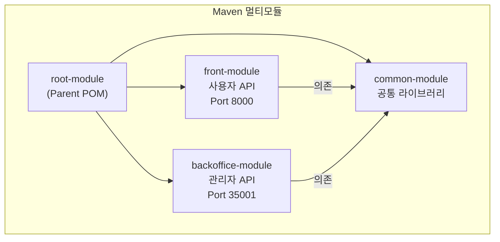
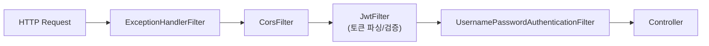

## Spring Boot 3 멀티모듈 구조

**요구**: 사용자 앱과 관리 백오피스는 배포 단위·포트·권한 모델이 다르지만, 도메인 로직과 영속성은 공유해야 합니다.

**선택**: Maven 멀티모듈로 **실행 가능한 API 두 개**와 **공통 라이브러리 한 개**로 나눴습니다. 사용자 API는 WebSocket까지 포함하고, 백오피스는 REST만 노출해 공격 면을 줄입니다.

**결과**: 공통 코드 중복 없이 팀·배포 경계를 명확히 하고, 사용자 트래픽과 운영자 기능을 인프라 수준에서 분리할 수 있습니다.

## REST API 역할 묶음

엔드포인트는 컨트롤러 단위 나열 대신 **업무 단위**로 묶였습니다.

- **인증·세션**: 로그인, JWT 발급, 중복 로그인 시 기존 세션 정리
- **사용자·회사(백오피스)**: 테넌트·멤버·모델(큐) 설정, 공지·파일
- **작업·업로드**: 작업 생성·목록·취소·리포트, SFTP 연동 업로드, 수동/선택적 비디오 블러 요청
- **대시보드**: 작업 유형·차트용 집계

POST 중심 API는 레거시 클라이언트와의 호환을 유지한 형태입니다.

## 인증/보안 (Spring Security + JWT)

**요구**: SaaS 테넌트 경계와 관리자 구분을 모든 요청에서 일관되게 적용하고, 비밀번호·민감 필드는 저장·전송 단계에서 보호해야 합니다.

**선택**: 무상태 JWT와 필터 체인으로 인증을 통일하고, 비밀번호는 BCrypt, 일부 필드는 대칭키 암호화를 사용합니다. WebSocket·업로드 등 예외 경로만 최소로 열어 둡니다.

**로그인 흐름**: 자격 증명 검증 → 회사 사용 여부 확인 → Redis로 중복 접속 처리(필요 시 기존 클라이언트에 로그아웃 신호) → JWT 발급.

**결과**: API·STOMP·업로드 파이프라인이 같은 신원·회사 맥락을 공유하고, 운영 정책(강제 로그아웃 등)을 한곳에서 적용할 수 있습니다.

## 실시간·메시징과의 연결

WebSocket STOMP, RabbitMQ 발행, Redis 구독·캐시의 **역할 분담과 이유**는 이 프로젝트의 **아키텍처** 탭(시스템 아키텍처) 통신 흐름 절에 정리되어 있습니다.

백엔드 쪽에서의 요지는 다음과 같습니다.

- 업로드·작업 승인 후 **첫 단계 큐로 메시지를 넣어** API 응답을 길게 붙잡지 않는다.
- Python Consumer가 올린 이벤트는 **한곳에서 Redis를 구독**해 WebSocket으로만 넘겨, 워커가 API URL을 알 필요 없게 한다.
- 작업·파일 건수 등 반복 조회는 **캐시**로 DB 부하를 줄인다.

## 데이터 액세스

**요구**: 복잡한 조회·리포트·기존 스키마와의 호환을 유지하면서도, 일부 도메인은 JPA 엔티티로 다루고 싶었습니다.

**선택**: **MyBatis**를 주력으로 SQL·매퍼를 명시하고, JPA는 DDL 없이 제한적으로 병행합니다. HikariCP와 MariaDB 드라이버로 풀링합니다.

**결과**: 보고서·목록 쿼리를 튜닝하기 쉽고, 팀에 익숙한 방식으로 유지보수할 수 있습니다.

## 도메인 서비스 구성

클래스 이름 나열 대신 **책임 묶음**으로 보면 다음과 같습니다.

- **사용자·회사·공지**: CRUD와 권한에 맞는 노출
- **작업·업로드**: 작업 생성, 파일 메타, PDF/Excel 리포트, 큐 메시지 발행
- **메시징·캐시**: Rabbit 발행, Redis 구독 후 STOMP 전달, Hash·캐시 갱신
- **대시보드·이력**: 통계, WebSocket 접속 이력

## 모니터링·문서

Actuator·Micrometer로 Prometheus 스크랩에 맞는 메트릭을 노출하고, SpringDoc으로 API를 문서화해 연동·검증 비용을 줄였습니다.
