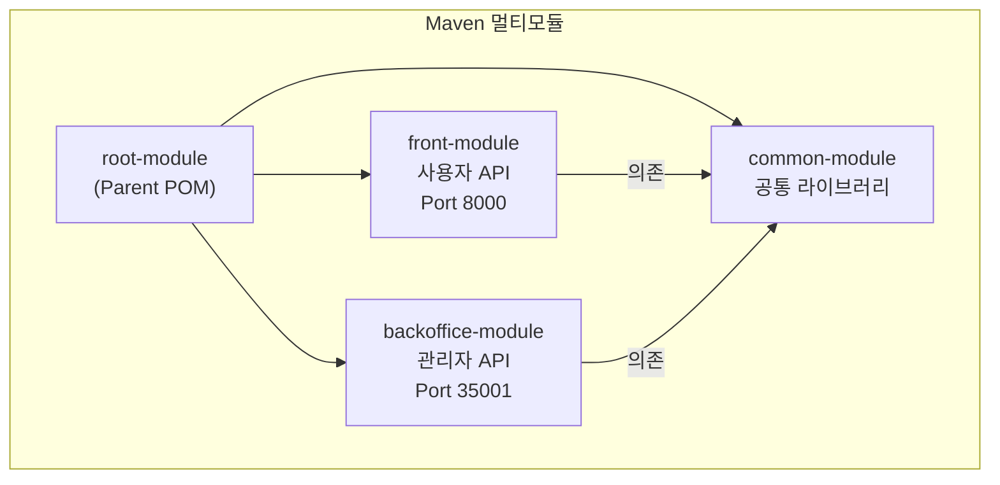
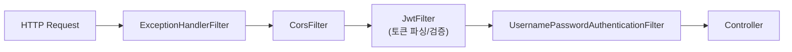
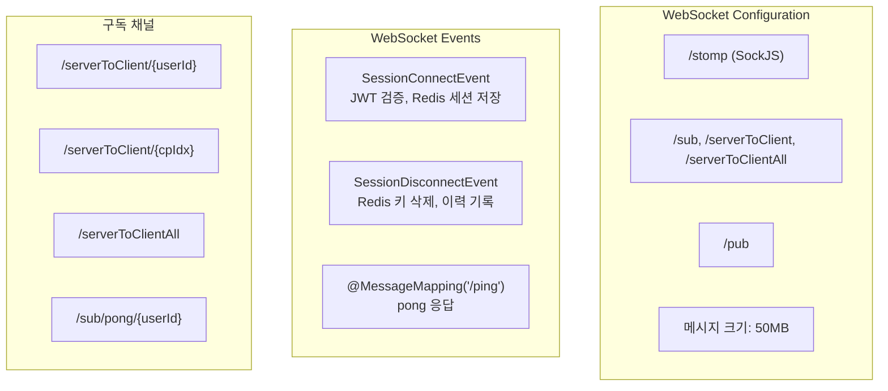

## Spring Boot 3 멀티모듈 구조

백엔드 API는 Spring Boot 3.2.4 기반 Maven 멀티모듈 프로젝트로 구성됩니다.

- **front-module**: 사용자용 REST API + WebSocket (포트 8000, context-path: /api)
- **backoffice-module**: 관리자용 REST API (포트 35001, context-path: /api)
- **common-module**: 공통 Service, VO, Mapper, 설정 클래스 (실행 불가, JAR만 생성)

## REST API 엔드포인트

### 사용자 API (front-module)

| 컨트롤러 | 엔드포인트 | 기능 |
|----------|-----------|------|
| **LoginController** | `POST /loginProc` | JWT 로그인, 중복 로그인 체크 |
| **UserController** | `POST /user/userList` | 사용자 목록 |
| | `POST /user/insertUser` | 사용자 등록 |
| | `POST /user/deleteUser` | 사용자 삭제 |
| | `POST /user/userInfoUpdate` | 정보 수정 |
| | `POST /user/userPasswdReset` | 비밀번호 초기화 |
| **TaskController** | `POST /task/create` | 작업 생성 |
| | `POST /task/getTaskList` | 작업 목록 |
| | `POST /task/getTaskDetail` | 작업 상세 |
| | `POST /task/cancelTask` | 작업 취소 |
| | `POST /task/deleteTask` | 작업 삭제 |
| | `POST /task/downloadPdfFile` | PDF 리포트 다운로드 |
| | `POST /task/downloadExcelFile` | Excel 리포트 다운로드 |
| | `POST /task/userSelectedObject` | 사용자 선택 객체 처리 |
| | `POST /task/selectiveVideoBlur` | 선택적 비디오 블러 요청 |
| **UploadController** | `POST /upload/fileUploadImageOneByOneFtp` | 이미지 FTP 업로드 |
| **DashboardController** | `POST /dashboard/taskTypeData` | 작업 유형 통계 |
| | `POST /dashboard/donutChart` | 도넛 차트 데이터 |
| | `POST /dashboard/barChart` | 막대 차트 데이터 |
| **NoticeController** | `POST /notice/getList` | 공지 목록 |
| | `GET /notice/fileDownload/{locale}/{noticeIdx}/{attachIdx}` | 첨부파일 다운로드 |

### 관리자 API (backoffice-module)

| 컨트롤러 | 주요 기능 |
|----------|-----------|
| **CompanyController** | 회사 CRUD, 멤버 관리, 사용 여부 변경 |
| **NoticeController** | 공지사항 CRUD, 다국어 파일 관리 |
| **ModelController** | AI 모델/큐 목록 조회 |
| **FileController** | 공지/회사 파일 업로드/다운로드 |
| **TaskController** | 관리자 작업 목록, 취소 |

## 인증/보안 (Spring Security + JWT)

### JWT 설정

- **라이브러리**: jjwt 0.11.5
- **알고리즘**: HS512
- **유효기간**: 86,400초 (24시간)
- **Claims**: `sub`(loginId), `cpIdx`(회사), `queueName`(큐), `adminYn`(관리자), `aistudioAPI`(authorities)

### Spring Security 필터 체인

- **JwtFilter**: `Authorization: Bearer` 헤더에서 토큰 파싱, 검증 후 `cpIdx`, `queueName`, `adminYn`을 request attribute로 전달
- **인증 예외 경로**: `/loginProc`, `/stomp/**`, `/upload/getProgress`, Swagger, Actuator
- **세션**: STATELESS
- **비밀번호**: BCryptPasswordEncoder
- **데이터 암호화**: AesBytesEncryptor (secret + salt)

### 로그인 흐름

1. `POST /loginProc` 수신 (userId, password, cpIdx)
2. `CustomUserDetailsService`로 사용자 조회
3. 회사 사용 여부 검증 (`cp_login_yn`)
4. Redis로 중복 로그인 체크 (기존 세션 강제 로그아웃)
5. JWT 토큰 생성, `AccessTokenVo` 반환

## WebSocket STOMP 설정

- **연결 시**: JWT 검증 → Redis에 `heidi:login:{sessionId}` 저장
- **해제 시**: Redis 키 삭제 → `websocket_hist` 테이블에 기록
- **인터셉터**: FilterChannelInterceptor (STOMP CONNECT 시 JWT 검증)

## RabbitMQ 메시지 프로듀서

### 설정

- **ConnectionFactory**: host, port, username, password (환경별 설정)
- **MessageConverter**: Jackson2JsonMessageConverter
- **DeliveryMode**: PERSISTENT (메시지 영속화)
- **큐 선언**: `Queue(queueName, durable=true)`, RabbitAdmin으로 동적 선언

### 메시지 발행

`UploadService.insertModelFile()`에서 파일 업로드 완료 후 RabbitMQ에 메시지 발행:
- 회사별 `model.queue_name`으로 동적 큐 결정
- `RabbitMessageVo` JSON 직렬화 후 전송

## Redis 활용

### 캐시

- Spring Cache (`@Cacheable`, `CacheManager`)
- 캐시명: `TASK_FILE_CNT` (작업별 파일 수)
- TTL: 30일

### Hash (상태 관리)

| 키 패턴 | 필드 | 용도 |
|---------|------|------|
| `heidi:file:{taskId}` | totalCnt, processCnt, successCnt, failCnt, status, progress | 작업 진행 상태 |
| `heidi:login:{sessionId}` | userId, cpIdx, dateTime | WebSocket 세션 |

### Pub/Sub (이벤트)

`StartRunComponent`에서 16개 채널 구독:
- `progress`, `start`, `end`, `error`, `fileDown`
- `zeroshotTrackEnd`, `zeroshotBlurEnd`
- `selectiveEnd`, `videoSelectiveEnd`, `videoSelectiveBlurEnd`, `videoSelectiveBlurComplete`
- `trackingEnd`, `videoEnd`

`RedisSubService`가 메시지 수신 → `SimpMessageSendingOperations`로 WebSocket 전달

## 데이터 액세스

- **ORM**: MyBatis 3 (주력) + JPA (DDL 없음, ddl-auto=none)
- **매퍼 위치**: `classpath:/mybatis/mapper/**/*.xml`
- **VO 패턴**: `TaskVo`, `UserVo`, `CompanyVo`, `ModelVo`, `ModelFileListVo` 등
- **드라이버**: MariaDB (log4jdbc 래핑)
- **커넥션 풀**: HikariCP

## 서비스 레이어

| 서비스 | 역할 |
|--------|------|
| `UserService` | 사용자 CRUD, 로그인 검증 |
| `TaskService` | 작업 CRUD, PDF/Excel 생성 (iText, Apache POI) |
| `UploadService` | 파일 업로드, 작업 생성, RabbitMQ 발행 |
| `MessageService` | RabbitMQ 메시지 발행 |
| `RedisSubService` | Redis Pub/Sub 구독 → WebSocket 전달 |
| `RedisPubService` | Redis Pub/Sub 발행 |
| `RedisNewService` | Redis Hash/Value/List/Set 연산 |
| `WebsocketHistService` | WebSocket 접속 이력 |
| `CustomUserDetailsService` | Spring Security 사용자 로드 |
| `DashboardService` | 대시보드 통계 |
| `CompanyService` | 회사 CRUD |
| `NoticeFoService` / `NoticeService` | 공지사항 CRUD |

## 모니터링

- **Prometheus**: Spring Boot Actuator + Micrometer
- **엔드포인트**: `/actuator/prometheus`, `/actuator/health`, `/actuator/info`
- **Swagger**: SpringDoc OpenAPI (`/api/swagger-ui/index.html`)
