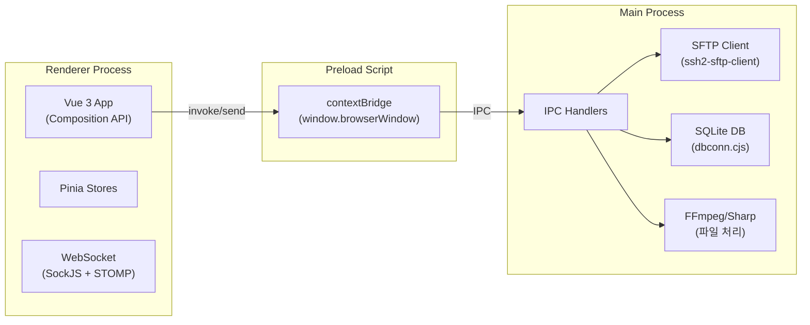
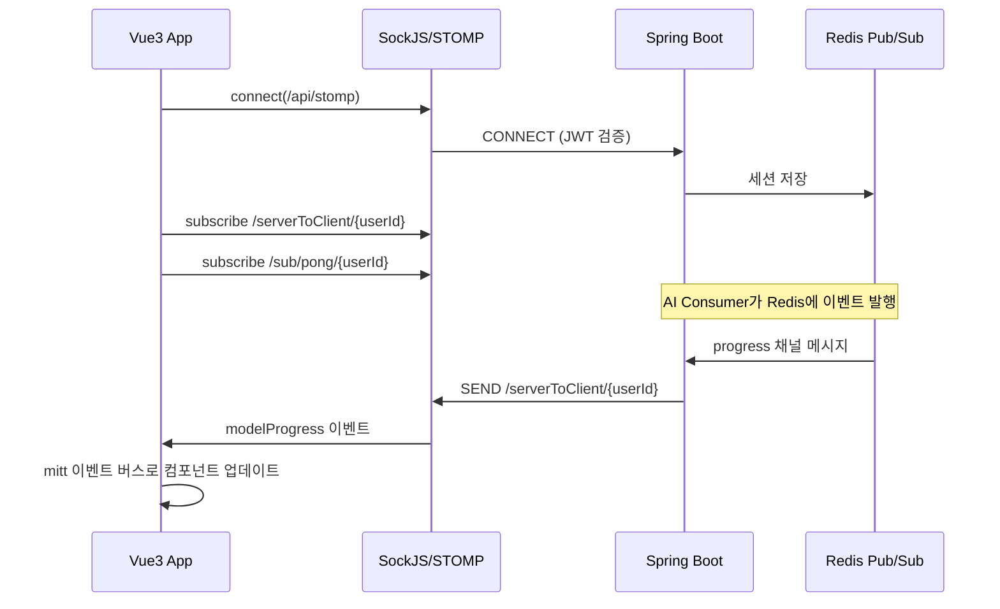

## 메인 앱: Vue 3 + Electron

메인 클라이언트는 Vue 3 기반 SPA를 Electron으로 래핑한 크로스플랫폼 데스크톱 애플리케이션입니다.

### 기술 스택

- **프레임워크**: Vue 3 (Composition API) + Vite 5
- **데스크톱**: Electron 30, electron-builder
- **상태관리**: Pinia (여러 스토어, 일부 localStorage 영속화)
- **UI**: PrimeVue 4 + Tailwind CSS 4
- **실시간**: SockJS + webstomp-client (STOMP over WebSocket)
- **다국어**: vue-i18n 9 (한국어, 영어, 일본어)
- **로컬 DB**: SQLite3 (수동 비식별화 임시 데이터)
- **파일 처리**: ssh2-sftp-client (SFTP), Sharp (이미지), FFmpeg (비디오)

### Electron: 왜 메인 프로세스와 나눴나

**요구**: 대용량 파일을 브라우저만으로 안정적으로 올리기 어렵고, 현장에서는 폴더 단위 배치·SFTP·로컬 캐시가 필요했습니다.

**선택**: **preload + contextBridge**로 렌더러에 최소 API만 노출하고, SFTP·SQLite·FFmpeg·네이티브 다이얼로그는 메인 프로세스에서만 실행합니다.

**과정·결과**: 사용자는 작업 생성 화면에서 폴더를 고르고 SFTP 업로드를 돌리며, 수동 편집 중에는 캔버스 결과를 로컬 SQLite에 잠깐 두었다가 서버와 동기화합니다. 권한이 필요한 작업은 메인에만 있어 보안·안정성을 맞출 수 있습니다.

### 화면 흐름(라우트 관점)

**요구**: 로그인 후 대시보드 → 작업 목록·생성 → 자동 처리 모니터링 → 필요 시 이미지/비디오 수동 편집 → 사용자·공지 관리로 이어지는 업무 동선을 한 앱 안에서 처리합니다.

**구성**: 로그인 전용 레이아웃과 사이드바형 메인 레이아웃을 나누고, 작업 상세·수동 편집은 `taskId` 기준 동적 경로로 진입합니다. 백오피스와 달리 **실시간 진행률**이 핵심이라 STOMP 구독을 앱 전역과 연동합니다.

### 상태 관리(Pinia)

**요구**: 작업 목록 필터, 다국어·로딩 같은 UI 상태와, 끊기지 않아야 하는 **진행률·소켓 연결**을 분리해 두고 싶었습니다.

**선택**: 로그인·작업 필터·공지 등은 세션/화면별 스토어로 두고, 진행률은 WebSocket 이벤트와 맞물리도록 스토어를 설계했으며 필요한 값만 localStorage에 남깁니다.

**결과**: 탭 이동·재접속 후에도 처리 현황을 잃지 않기 쉽고, 컴포넌트 간 이벤트 버스(mitt)와 조합해 진행 UI를 단순히 유지합니다.

### WebSocket 실시간 연동

**요구**: 서버에서 오는 진행·완료·오류를 즉시 반영해 장시간 작업의 신뢰도를 높입니다.

**선택**: STOMP 구독 후 수신 메시지의 유형 필드를 보고 mitt로 관련 화면에 전달합니다.

**결과**: 진행률 바·완료 알림·다운로드 준비 등이 폴링 없이 갱신되고, 아키텍처 탭의 파이프라인 설명과 같은 서버 흐름과 맞닿아 있습니다.

### 수동 비식별화 편집

**요구**: 자동 탐지가 빗나간 구간만 사용자가 고치고 싶은 경우가 많아, 캔버스 기반 편집이 필요했습니다.

**과정**: 이미지는 영역 선택 후 로컬 저장과 API 요청을 병행하고, 비디오는 초기 박스를 넣은 뒤 트래킹 결과를 받아 전 프레임 블러로 이어집니다.

**결과**: 엔터프라이즈 현장에서 “완전 자동”과 “사람이 보정”을 같은 제품 안에서 전환할 수 있습니다.

## 백오피스: Vue 3 웹

**요구**: 관리자는 데스크톱 설치 없이 브라우저에서 테넌트·공지·작업 감시·포인트·탈퇴 처리를 해야 합니다.

**선택**: 별도 Vue 3 SPA로 두고 PrimeVue·SCSS 기반으로 단순한 화면 집합을 구성했습니다. 공지는 WYSIWYG 에디터로 다국어 첨부까지 다룹니다.

**결과**: 운영 업무는 웹으로, 실제 비식별 작업은 Electron으로 나누어 각 역할에 맞는 배포 형태를 취했습니다.
