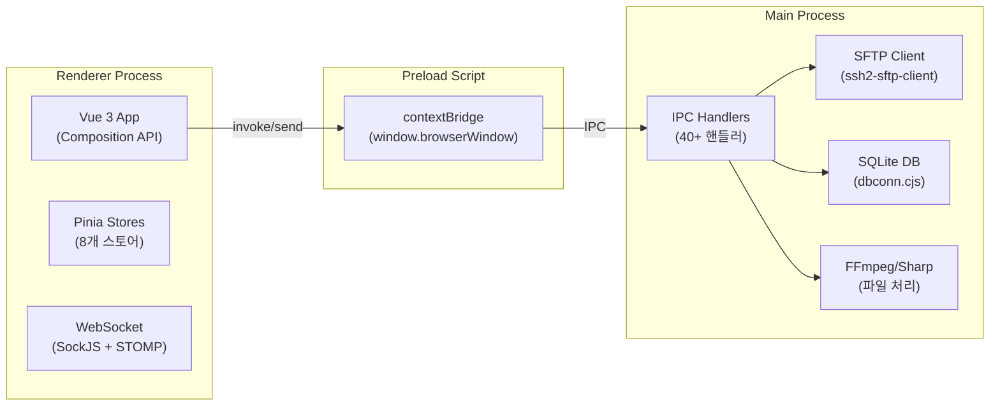
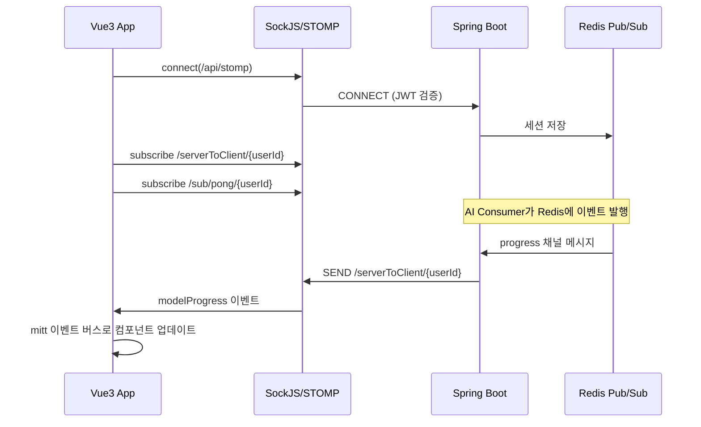

## 메인 앱: Vue 3 + Electron

메인 클라이언트는 Vue 3 기반 SPA를 Electron으로 래핑한 크로스플랫폼 데스크톱 애플리케이션입니다.

### 기술 스택

- **프레임워크**: Vue 3 (Composition API) + Vite 5
- **데스크톱**: Electron 30, electron-builder
- **상태관리**: Pinia (8개 스토어, localStorage 영속화)
- **UI**: PrimeVue 4 + Tailwind CSS 4
- **실시간**: SockJS + webstomp-client (STOMP over WebSocket)
- **다국어**: vue-i18n 9 (한국어, 영어, 일본어)
- **로컬 DB**: SQLite3 (수동 비식별화 데이터 저장)
- **파일 처리**: ssh2-sftp-client (SFTP), Sharp (이미지), FFmpeg (비디오)

### Electron 아키텍처

**주요 IPC 핸들러**:
- `chooseFolder` - 폴더 선택 다이얼로그
- `startElectronFileTaskFtp` - SFTP 파일 업로드
- `fileDownLoadFtp` - SFTP 파일 다운로드
- `selectiveImageLoad/Save` - 수동 비식별화 이미지 로드/저장
- `selectiveVideoLoad` - 수동 비식별화 비디오 로드
- `insertManualImage/Video` - 수동 좌표 SQLite 저장
- `insertTrackZeroShot` - 제로샷 트래킹 요청
- `cancelTask` - 작업 취소

### 라우트 구조

| 경로 | 컴포넌트 | 기능 |
|------|----------|------|
| `/login` | Login.vue | JWT 인증 로그인 |
| `/introduction/introduction` | Introduction.vue | 대시보드 (차트, 작업 통계) |
| `/task/taskList/:page` | TaskList.vue | 작업 목록 (검색, 필터, 페이지네이션) |
| `/task/create` | TaskCreate.vue | 작업 생성 (파일 선택, 옵션 설정) |
| `/task/selective/:taskId` | TaskSelective.vue | 이미지 수동 비식별화 편집 |
| `/task/videoSelective/:taskId` | TaskSelectiveVideo.vue | 비디오 수동 비식별화 편집 |
| `/user/userList` | UserList.vue | 사용자 관리 (CRUD) |
| `/noticeList/NoticeList` | NoticeList.vue | 공지사항 목록 |

**레이아웃 패턴**: LoginLayout(로그인 전용), OtherLayout(Sidebar + Header + 메인 콘텐츠)

### Pinia 스토어

| 스토어 | 역할 | 영속화 |
|--------|------|--------|
| `login` | 사용자 정보 (userId, adminYn, cpIdx) | - |
| `taskList` | 작업 목록 필터 상태 | - |
| `taskProgress` | 실시간 처리 진행률 추적 | localStorage |
| `socket` | WebSocket 연결 상태 | - |
| `page` | UI 상태 (언어, 로딩) | - |
| `noticeList` | 공지사항 상태 | - |
| `delivery` | Delivery 모드 서버 설정 | localStorage |
| `content` | 사용자 상세 정보 | - |

### WebSocket 실시간 연동

**이벤트 처리 흐름**:
1. WebSocket 메시지 수신 (`gubun` 필드로 이벤트 유형 구분)
2. mitt 이벤트 버스로 해당 컴포넌트에 전달
3. Pinia `taskProgress` 스토어 상태 업데이트
4. UI 자동 반영 (진행률 바, 완료 알림 등)

### 수동 비식별화 편집 기능

이미지/비디오에서 사용자가 직접 비식별화 영역을 지정하는 캔버스 기반 편집 기능:

- **이미지**: 드래그로 영역 선택 → SQLite 저장 → API로 블러 요청
- **비디오**: 프레임별 영역 선택 → ODTrack으로 자동 트래킹 → 전체 프레임 블러

## 백오피스: Vue 3 웹

관리자용 백오피스는 별도의 Vue 3 SPA로 개발되었습니다.

### 기술 스택

- Vue 3 + Vite 5, Pinia (1개 스토어)
- PrimeVue 3, SCSS
- @vueup/vue-quill (공지사항 에디터)

### 주요 기능

| 기능 | 설명 |
|------|------|
| 회사 관리 | 테넌트 CRUD, 사용 여부, 멤버 관리 |
| 작업 관리 | 전체 작업 목록 조회, 취소 |
| 공지사항 | WYSIWYG 에디터, 다국어 파일 업로드 |
| 포인트 관리 | 충전, 소멸, 이력 조회 |
| 탈퇴 관리 | 회사 탈퇴 요청 처리 |
