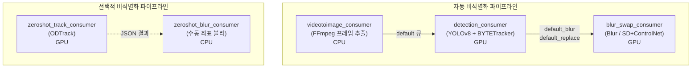

## 파이프라인 개요

Heidi의 AI 처리 파이프라인은 5개의 독립적인 Python Consumer 마이크로서비스로 구성됩니다. 각 Consumer는 RabbitMQ 큐를 구독하고, 처리 결과를 다음 큐 또는 Redis Pub/Sub로 전달합니다.



## Consumer 상세

### 1. videotoimage_consumer (비디오 → 프레임 추출)

- **구독 큐**: `videotoimage`
- **발행 큐**: 동적 (`json_data['queueName']`, 예: `default`)
- **처리**: FFmpeg로 비디오를 프레임 이미지로 분할
  - `ffprobe`로 총 프레임 수 확인
  - `ffmpeg -i <video> -vsync 0 -start_number 0 <output_pattern>`
  - 출력: `{video_path}/{basename}_0.jpg`, `_1.jpg`, ...
- **리소스**: CPU 전용
- **Docker**: `vti_con:1.0`

### 2. detection_consumer (객체 탐지)

- **구독 큐**: `default`
- **발행 큐**: `{queue}_blur` 또는 `{queue}_replace` (type에 따라)
- **AI 모델**:
  - **YOLOv8/v10**: `./weights/ver_8_1_2.pt` 기반 객체 탐지
  - **클래스**: face(얼굴), plate(번호판), person
  - **추론**: confidence threshold 0.3, NMS IoU threshold 0.45
  - **추론 엔진**: ONNX Runtime GPU + TensorRT 10.8
- **트래킹**: BYTETracker
  - 프레임 간 동일 객체 추적 (track_id 부여)
  - 프레임 간 보간 처리
- **출력 JSON**:
  ```json
  {
    "0": [{"det": [x1, y1, x2, y2, score, label], "track_id": 1, "class": "face"}],
    "1": [{"det": [x1, y1, x2, y2, score, label], "track_id": 1, "class": "face"}]
  }
  ```
- **Redis**: `start` 이벤트 발행, Hash 상태 업데이트 (`status: progress`)
- **리소스**: GPU (nvidia/cuda:12.2.2-cudnn8-devel-ubuntu22.04)
- **Docker**: `detection_con:1.0` (스케일아웃: detection_con_1 ~ N)

### 3. blur_swap_consumer (블러/교체 처리)

- **구독 큐**: `default_blur` (블러 모드) 또는 `default_replace` (교체 모드)
- **모드 구분**: `TYPE` 환경변수로 `blur` / `replace` 결정

#### Blur 모드
- `cv2.blur()`로 face/plate 영역 가우시안 블러
- blur_rate: 0.6, 커널 크기 = `max(h, w) / 3`

#### Replace 모드 (AI 합성 교체)
- **얼굴 교체**:
  1. SPIGA 랜드마크 검출
  2. Stable Diffusion 1.5 + ControlNet Canny + IP-Adapter-FaceID
  3. insightface로 얼굴 특징 추출
  4. SD Inpainting으로 자연스러운 얼굴 합성
- **번호판 교체**:
  1. HOG 기반 번호판 영역 검출
  2. 랜덤 번호 생성
  3. Poisson blending으로 자연스러운 합성

- **Redis 이벤트**:
  - `progress`: 처리 진행률 (processCnt, successCnt, redisTotalCnt)
  - `fileDown`: 개별 파일 처리 완료
  - `end`: 전체 작업 완료
  - `selectiveEnd`: 옵션 비식별화 완료
- **리소스**: GPU
- **Docker**: `blur_swap_con:1.0` (스케일아웃: blur_con 1~9, swap_con 1~3)

### 4. zeroshot_track_consumer (제로샷 비디오 트래킹)

- **구독 큐**: `tracking_zeroshot`
- **AI 모델**: ODTrack (가중치: `ODTrack_ep0300.pth.tar`)
  - Zero-shot 비디오 객체 트래킹
  - 사용자 지정 초기 bbox에서 시작하여 전체 프레임 추적
- **입력**:
  ```json
  {
    "taskId": "T00041694",
    "fileList": [
      {
        "saveFilePath": "/path/to/video",
        "frame": 0,
        "manualX1": 100, "manualY1": 50,
        "manualX2": 200, "manualY2": 150,
        "trackId": 1,
        "gubun": "face"
      }
    ]
  }
  ```
- **출력 JSON**: `{image_folder}/{trackId}.json`
  - 프레임별 추적 bbox와 클래스 정보
- **클래스 매핑**: face(0), plate(1), other(2)
- **Redis**: `zeroshotTrackEnd` 이벤트 발행
- **리소스**: GPU
- **Docker**: `zeroshot_track_con:1.0`
- **핵심 라이브러리**: timm, einops, PyTorch

### 5. zeroshot_blur_consumer (수동 좌표 블러)

- **구독 큐**: `video_selective_blur`
- **처리**:
  1. 수동 지정 JSON에서 face/plate/other별 좌표 로드
  2. `cv2.blur()`로 해당 영역 프레임별 블러
  3. FFmpeg로 블러 비디오 + 원본 오디오 합성 (`-map 0:a? -map 1:v -shortest`)
- **입력 JSON 포맷**:
  ```json
  {
    "face": {
      "ids": [1, 2],
      "0": {"x1": 100, "y1": 50, "x2": 200, "y2": 150},
      "1": {"x1": 300, "y1": 100, "x2": 400, "y2": 200}
    },
    "plate": { "ids": [], ... },
    "other": { "ids": [], ... }
  }
  ```
- **Redis**: `fileDown`, `zeroshotBlurEnd` 이벤트 발행
- **리소스**: CPU 전용
- **Docker**: `zeroshot_blur_con:1.0`

## GPU/CPU 분리 전략

| Consumer | GPU/CPU | 이유 |
|----------|---------|------|
| videotoimage | CPU | FFmpeg은 CPU 기반 인코딩/디코딩 |
| detection | GPU | 딥러닝 추론 (YOLOv8, ONNX/TensorRT) |
| blur_swap (blur) | GPU | Stable Diffusion 추론 (replace 모드) |
| blur_swap (blur only) | CPU 가능 | cv2.blur는 CPU로도 충분 |
| zeroshot_track | GPU | ODTrack 딥러닝 추론 |
| zeroshot_blur | CPU | OpenCV 블러만 사용 |

## Docker 컨테이너화

- **베이스 이미지**: `nvidia/cuda:12.2.2-cudnn8-devel-ubuntu22.04`
- **볼륨 마운트**: `/mnt/dms/heidi_saas/dev/heidi_storage/heidi_file` (공유 스토리지)
- **네트워크**: `heidi` (Docker external network)
- **스케일아웃**: 동일 큐를 구독하는 Consumer 인스턴스를 여러 개 실행 (예: blur_con 1~9)

## 환경 변수

| 변수 | 설명 |
|------|------|
| `ENV` | 환경 (local, dev, prd) |
| `REDIS_HOST` / `PORT` / `PASSWORD` | Redis 접속 |
| `REDIS_NAME` | Redis 키 prefix (예: `heidi:file:`) |
| `REDIS_OPTION_NAME` | 옵션 처리용 prefix (예: `heidi:option:`) |
| `RABBITMQ_HOST` / `PORT` / `USER` / `PASSWORD` | RabbitMQ 접속 |
| `RABBITMQ_HEARTBEAT` | RabbitMQ heartbeat 간격 |
| `TYPE` | blur_swap Consumer 모드 (blur / replace) |

## AI 모델 목록

| 모델 | 용도 | Consumer |
|------|------|----------|
| YOLOv8/v10 (`ver_8_1_2.pt`) | 얼굴/번호판 탐지 | detection |
| BYTETracker | 멀티 객체 트래킹 | detection |
| Stable Diffusion 1.5 | 얼굴 합성 (Inpaint) | blur_swap (replace) |
| ControlNet Canny | SD 가이드 | blur_swap (replace) |
| IP-Adapter-FaceID | 얼굴 특성 유지 | blur_swap (replace) |
| insightface | 얼굴 특징 추출 | blur_swap (replace) |
| SPIGA | 얼굴 랜드마크 검출 | blur_swap (replace) |
| ODTrack (`ODTrack_ep0300.pth.tar`) | 제로샷 비디오 트래킹 | zeroshot_track |
