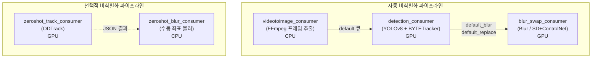

## 파이프라인 개요

**요구**: 비디오 비식별은 **전처리(프레임화) → 탐지·트래킹 → 블러 또는 합성 교체**로 단계가 길고, GPU와 CPU 부하가 단계마다 다릅니다. 한 프로세스에 몰면 장애 시 전체가 멈추고, 블러만 필요한 작업과 합성 교체가 같은 자원을 쓰기 어렵습니다.

**선택**: 단계별로 **독립 Python Consumer**를 두고 RabbitMQ로 hand-off합니다. 자동 파이프라인과 수동·제로샷 파이프라인은 큐를 달리해 운영 중 트래픽을 분리합니다.

**결과**: 병목 단계만 스케일아웃하고, 컨테이너 단위로 배포·롤백할 수 있습니다.

## Consumer별: 목적·방식·결과

### 1. videotoimage (비디오 → 프레임)

**왜 분리**: 딥러닝 전에 코덱·해상도가 제각각인 원본을 **일관된 이미지 시퀀스**로 만들어야 이후 탐지 파이프라인이 단순해집니다.

**방식**: FFmpeg로 프레임을 추출하고, 다음 단계 큐로 메시지를 넘깁니다.

**결과**: GPU 탐지 워커는 “비디오 디코딩”과 “모델 추론”을 동시에 하지 않아도 되어 자원 사용이 예측 가능해집니다.

### 2. detection (객체 탐지·트래킹)

**왜 이 스택**: 얼굴·번호판 등을 프레임마다 안정적으로 잡고, 동일 객체에 ID를 유지해야 블러/교체가 프레임 간 들쭉날쭉하지 않습니다.

**방식**: YOLO 계열 탐지에 BYTETracker로 시계열 일관성을 보강하고, ONNX Runtime과 TensorRT로 GPU 추론 지연을 줄입니다.

**결과**: 긴 영상에서도 탐지 품질과 처리 시간의 균형을 맞추고, 이후 단계는 “좌표·라벨이 정리된 입력”만 받으면 됩니다.

### 3. blur_swap (블러 / 합성 교체)

**왜 두 모드**: 규제·고객 요구에 따라 **가벼운 블러**만으로 충분한 경우와, **얼굴·번호판을 합성으로 교체**해야 하는 경우가 함께 존재합니다.

**방식**: 블러 모드는 전통적 영상 처리로 처리량을 확보하고, 교체 모드는 Stable Diffusion·ControlNet·얼굴 특성 어댑터 등을 조합해 자연스러운 결과를 냅니다. 진행·파일 완료·작업 종료는 Redis 이벤트로 API·UI와 연결됩니다.

**결과**: 같은 탐지 결과물로 “빠른 처리”와 “고품질 교체”를 제품 옵션으로 나눌 수 있습니다.

### 4. zeroshot_track (수동 시드 트래킹)

**왜 필요**: 사용자가 캔버스에서 찍은 초기 박스만으로 이후 프레임을 따라가야 수동 보정 비용이 줄어듭니다.

**방식**: ODTrack 계열 제로샷 트래킹으로 비디오 전 구간 좌표를 생성하고, 완료 시점에 서버·클라이언트가 다음 단계로 넘어가게 이벤트를 씁니다.

**결과**: 프레임마다 손으로 그리지 않고도 비디오 수동 비식별이 실용적인 시간 안에 끝납니다.

### 5. zeroshot_blur (좌표 기반 블러)

**왜 CPU로도 되는가**: 입력이 이미 좌표 궤적로 정리되어 있어 **OpenCV 블러·오디오 붙이기** 중심이면 GPU 합성 파이프라인과 자원 경쟁을 피할 수 있습니다.

**방식**: 트래킹 JSON과 원본 영상을 받아 프레임별 블러 후 영상을 합성합니다.

**결과**: 수동 워크플로의 마지막 단계를 가볍게 유지해 전체 비용을 낮춥니다.

## GPU/CPU 분리 전략

| Consumer | GPU/CPU | 이유 |
|----------|---------|------|
| videotoimage | CPU | 디코딩·인코딩은 FFmpeg CPU 경로가 주력 |
| detection | GPU | 딥러닝 추론 + TensorRT 등 가속 |
| blur_swap (replace) | GPU | 확산 모델 기반 합성 |
| blur_swap (blur만) | CPU 가능 | 단순 블러는 CPU로 처리량 확보 |
| zeroshot_track | GPU | 트래킹 네트워크 추론 |
| zeroshot_blur | CPU | 좌표 적용 블러 중심 |

**결과**: GPU 노드를 비싼 단계에만 몰아 비용 대비 처리량을 조정할 수 있습니다.

## 배포·운영

Consumer는 CUDA 기반 이미지로 컨테이너화하고, 공유 스토리지와 브로커·Redis에 붙여 **같은 큐를 여러 인스턴스가 나눠 소비**하게 했습니다. 환경(개발/스테이징/운영)과 브로커·캐시 접속 정보는 배포 시 주입해 코드 변경 없이 이중화·이전이 가능합니다.

## 모델 구성(요약)

탐지·트래킹·블러·합성 교체에 쓰인 모델은 역할별로 조합됩니다: **탐지(YOLO 계열) + 트래킹(BYTETracker / ODTrack)**, **블(OpenCV) 또는 합성(SD·ControlNet·얼굴 특성 모듈·랜드마크 등)**. 세부 가중치 이름보다 **품질·지연·비용 트레이드오프를 나누기 위한 조합**이 설계의 핵심입니다.
