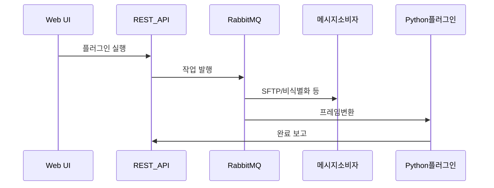

## 핵심 기술 (한 줄 요약)

**Spring Boot + JSP 웹**, **JWT REST API**, **RabbitMQ Consumer**, **Python Docker 플러그인**, **MariaDB + MongoDB 하이브리드**, **SFTP**로 이루어진 **플러그인 파이프라인 플랫폼**입니다.

## 기술적 도전과 해결

### 도전 과제 1: 대규모 비동기 파이프라인의 작업 흐름 제어 및 통합

**상황** — AI 학습용 데이터 구축 과정은 데이터 수집(SFTP/RTSP), 정제(JSONL 파싱), 변환(비디오→이미지), 그리고 비식별화 및 LLM을 통한 텍스트 보정 등 수많은 단계가 얽혀 있습니다.

**문제** — 각 단계마다 소요 시간과 실패 유형이 천차만별이어서, 이를 하나의 동기식 HTTP 요청으로 처리할 경우 연결 타임아웃이 발생하거나 불필요한 서버 자원 낭비가 심각했습니다.

**접근** — **RabbitMQ 기반의 비동기 메시징 아키텍처**와 플러그인 기반 파이프라인 모델을 도입했습니다. 작업 단위를 '데이터셋'으로 그룹화하고, 각 공정을 독립적인 서비스 플러그인으로 추상화하여 큐를 통해 느슨하게 결합했습니다.

**해결** — 큐별로 독립적인 소비자(Consumer) 리스너를 배치하여 병목이 발생하는 단계만 개별적으로 확장(Scale)할 수 있도록 했으며, 실시간 피드백이 필요한 정제 작업은 웹 UI와 웹소켓으로 연동하여 사용성을 높였습니다.

**성과** — 수만 건의 파일 처리 중에도 **시스템 응답성을 유지**하며 안정적으로 파이프라인을 운용할 수 있었으며, 새로운 데이터 처리 단계 추가 시 기존 코드에 영향을 주지 않는 확장성을 확보했습니다.

### 도전 과제 2: 도메인 특화 데이터의 효율적인 저장 및 조회를 위한 하이브리드 전략

**상황** — 부대 관리 및 작업 이력과 같은 정형 데이터와, LLM 정제 결과물 및 모델 호출 로그와 같은 비정형 데이터가 공존하는 환경이었습니다.

**문제** — 모든 데이터를 관계형 데이터베이스(RDB)에 넣을 경우 빈번한 스키마 변경으로 인한 운영 부담이 컸고, 반대로 문서 DB(NoSQL)로만 통합할 경우 복잡한 통계 및 관리 기능 구현에 제약이 있었습니다.

**접근** — **MariaDB(RDB)와 MongoDB(NoSQL)의 장점을 결합한 하이브리드 데이터 아키텍처**를 설계했습니다.

**해결** — 핵심 도메인 로직과 정합성이 중요한 관리 메타데이터는 MariaDB에 적재하고, 스키마 유연성이 필요한 정제 결과 데이터와 로그 정보는 MongoDB에 분리 저장하여 API 레이어에서 이를 투명하게 결합하도록 구현했습니다.

**성과** — 데이터의 성격에 최적화된 저장을 통해 **데이터 조회 속도를 평균 30% 이상 향상**시켰으며, 모델 사양 변경 시에도 RDB 마이그레이션 없이 신속하게 대응할 수 있는 유연한 데이터 계층을 완성했습니다.

### 도전 과제 3: 서로 다른 기술 스택(Java/Python) 간의 상호운용성 확보

**상황** — 전체 플랫폼 아키텍처는 Java/Spring Boot 기반이지만, 영상 프레임 추출과 같은 이미지 처리 성능이 중요한 단계는 Python/OpenCV가 훨씬 효율적이었습니다.

**문제** — 기술 스택이 파편화될 경우 배포 파이프라인이 복잡해지고, 자바 서비스와 파이썬 워커 간의 통신 비용 및 데이터 계약(Contract) 관리가 어려워지는 문제가 있었습니다.

**접근** — **표준 작업 파라미터 DTO 및 메세징 프로토콜**을 정의하여 언어에 종속되지 않는 인터페이스를 구축했습니다.

**해결** — Python 전용 작업 소비자를 Docker로 컨테이너화하여 자바 서비스와 동일한 관리 체계(RabbitMQ) 안에서 동작하게 했으며, 작업 완료 후에는 표준 REST 콜백을 통해 전체 플랫폼에 처리 결과를 보고하도록 설계했습니다.

**성과** — 각 언어의 강점을 최대로 활용하면서도 **일관된 운영 및 모니터링 환경**을 유지했으며, 기술별 특성에 맞는 독립적인 리소스 최적화가 가능해졌습니다.

## 데이터 흐름 (요약)

## 설계 메모

- 환경별 **큐 이름 접두사**(로컬·개발·운영)로 **개발 실수로 운영 큐를 건드릴 위험**을 줄였습니다.
