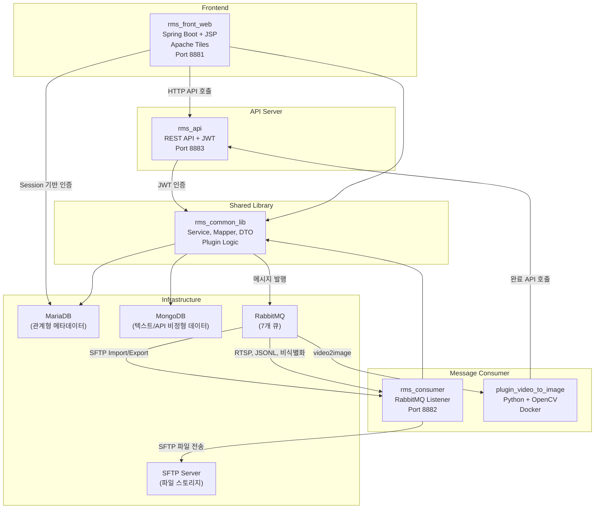
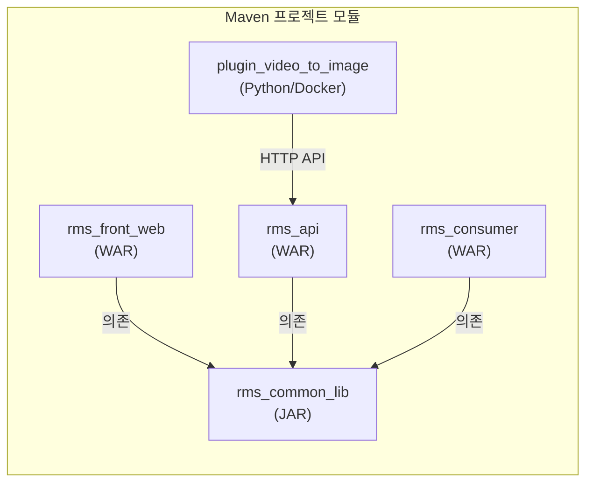
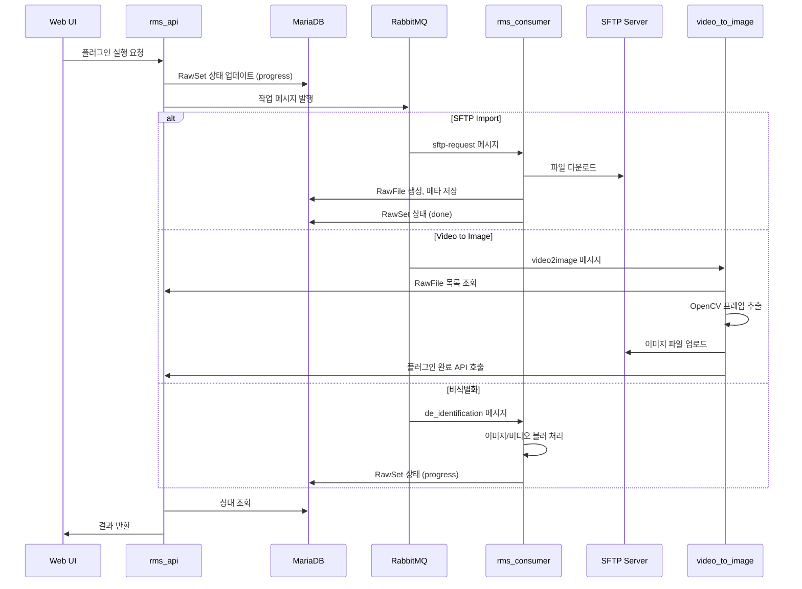

## 전체 시스템 구성

RMS는 **프론트엔드(Spring Boot + JSP)**, **REST API 서버(Spring Boot)**, **메시지 Consumer(Spring Boot)**, **Python 플러그인**, **공통 라이브러리**의 5개 모듈로 구성된 멀티 프로젝트입니다.

## 모듈 구조 및 의존성

- **rms_common_lib**: 모든 Java 모듈이 공유하는 핵심 라이브러리 (Service, Mapper, DTO/VO, Plugin Logic)
- **rms_api**: 외부(플러그인, 클라이언트) 연동용 REST API, JWT 인증
- **rms_front_web**: 관리자/작업자용 웹 UI, Session 기반 인증
- **rms_consumer**: RabbitMQ 비동기 작업 처리
- **plugin_video_to_image**: Docker 컨테이너로 배포되는 Python 비디오 변환 서비스

## 플러그인 기반 파이프라인

**요구**: 수집(SFTP·CCTV·API)·변환(비디오→이미지·JSONL)·비식별화·보내기·메타 추출·(웹에서 하는) 정제까지 단계가 많고, 각 단계의 실행 시간과 실패 방식이 다릅니다. 모든 것을 동기 HTTP로 묶으면 타임아웃과 재시도가 복잡해집니다.

**선택**: RawSet에 플러그인을 조합하는 **파이프라인 모델**을 두고, 무겁거나 외부 시스템에 닿는 단계는 **RabbitMQ로 비동기**로 넘기며, 작업자가 즉시 피드백이 필요한 정제·일부보내기는 **웹 UI에서 동기**로 처리합니다.

**결과**: 운영자는 같은 UI에서 파이프라인을 구성하고, 백그라운드 워커가 파일·스트림 처리를 맡아 시스템 전체 처리량을 맞출 수 있습니다.

### 플러그인 유형(요약)

| 유형 | 역할 | 비동기(큐) vs 동기(UI/API) |
|------|------|---------------------------|
| Import | 원본 유입(SFTP, RTSP, API, Excel 등) | 대부분 비동기, 일부 API/Excel은 동기 |
| Transform / Profile | 비디오 분해, JSONL 파싱, 비식별화, 메타 추출 | 비동기 위주 |
| Refine | LLM·이미지·비디오 정제 | 웹 도구 동기 |
| Export | SFTP·파일 묶음·리포트 | SFTP 등은 비동기, Excel/JSON/ZIP 등은 UI 동기 |

### 데이터 흐름

## RabbitMQ

**요구**: Java Consumer와 Python 비디오 플러그인이 같은 작업 버스를 써야 하고, import/export/transform/profile 등 **역할별로 실패·재시도·스케일을 분리**하고 싶었습니다.

**선택**: 환경별 prefix(`local` / `dev` / `prd`)를 둔 전용 큐로 나누어, SFTP 입출력·RTSP 수집·비디오→이미지·JSONL 변환·비식별화·메타 프로파일 등을 각각 구독자에 바인딩합니다.

**결과**: 한 종류의 작업만 병목일 때 해당 Consumer만 늘리면 되고, 플러그인 추가 시에도 큐 계약만 맞추면 됩니다.

## 데이터 저장소

**MariaDB**에는 사용자·RawSet·플러그인 정의·파일·메타 키·프리셋 등 **트랜잭션과 조인이 필요한 운영 메타**를 둡니다. **MongoDB**에는 LLM 정제 결과처럼 스키마가 자주 바뀌는 텍스트 블록과 모델 API 호출 이력처럼 **문서형 로그**를 둬서, 관계형 스키마를 과도하게 늘리지 않습니다.

**결과**: UI·리포트용 구조화 데이터와 실험·정제 산출물을 분리해 각각 튜닝할 수 있습니다.

## 인프라 구성

웹 UI(`rms_front_web`), JWT API(`rms_api`), 큐 워커(`rms_consumer`), MariaDB, MongoDB, RabbitMQ, SFTP, Nginx(리버스 프록시·정적 이미지)가 한 세트로 동작합니다. 포트는 환경별로 구성되며, 역할은 위 모듈 구성도와 동일합니다.
