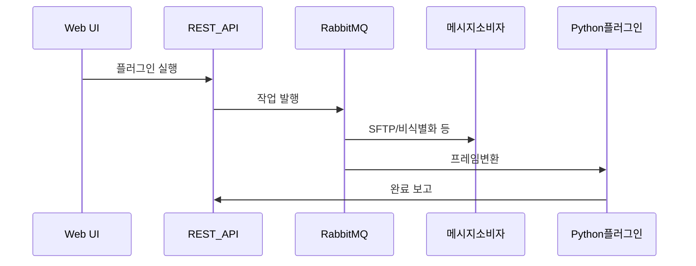

## 핵심 기술 (한 줄 요약)

**Spring Boot + JSP 웹**, **JWT REST API**, **RabbitMQ Consumer**, **Python Docker 플러그인**, **MariaDB + MongoDB 하이브리드**, **SFTP**로 이루어진 **플러그인 파이프라인 플랫폼**입니다.

## 기술적 도전과 해결

### Challenge: 수집·변환·정제·보내기 단계가 모두 다른 시간 스케일

**상황** — SFTP Import, RTSP, 비디오→이미지, JSONL 파싱, 비식별화, LLM 정제 등 **실패 방식과 소요 시간**이 제각각입니다.

**문제** — 동기 HTTP로 한 번에 묶으면 타임아웃·재시도가 복잡해집니다.

**접근** — **작업 데이터셋(상위 그룹)** 단위로 **플러그인 파이프라인 모델**을 두고, 무거운 단계는 **MQ 비동기**, 즉시 피드백이 필요한 정제는 **웹 UI 동기**로 나눴습니다.

**해결** — Consumer 리스너를 큐별로 쪼개 스케일·재시도 단위를 분리했습니다.

**성과** — 운영자는 같은 UI에서 파이프라인을 구성하고, 백그라운드가 **처리량을 흡수**합니다.

### Challenge: 관계형 메타와 비정형 텍스트/로그의 저장 전략

**상황** — 데이터셋·파일 메타는 조인·트랜잭션이 필요하고, LLM 정제 산출은 스키마가 자주 바뀝니다.

**문제** — 전부 RDB에 넣으면 마이그레이션 지옥, 전부 문서 DB면 보고가 어렵습니다.

**접근** — **MariaDB**에는 운영 메타, **MongoDB**에는 실험·정제 로그·모델 호출 이력을 뒀습니다.

**해결** — API 계층에서 읽기 경로를 명확히 나눴습니다.

**성과** — 각 저장소를 **독립 튜닝**할 수 있었습니다.

### Challenge: Java Consumer와 Python 플러그인이 같은 작업 버스를 쓰기

**상황** — 비디오 프레임 추출은 OpenCV Python이 유리했습니다.

**문제** — 언어가 다르면 배포·재시도 정책이 갈라집니다.

**접근** — **비디오→이미지 전용 큐**로 Python 컨테이너를 붙이고, 완료는 **REST 콜백**으로 상태를 맞췄습니다.

**해결** — **공통 작업 파라미터 DTO**로 큐 계약을 고정했습니다.

**성과** — **자바와 파이썬을 같은 오케스트레이션**으로 운용할 수 있었습니다.

## 데이터 흐름 (요약)

## 설계 메모

- 환경별 **큐 이름 접두사**(로컬·개발·운영)로 **개발 실수로 운영 큐를 건드릴 위험**을 줄였습니다.
