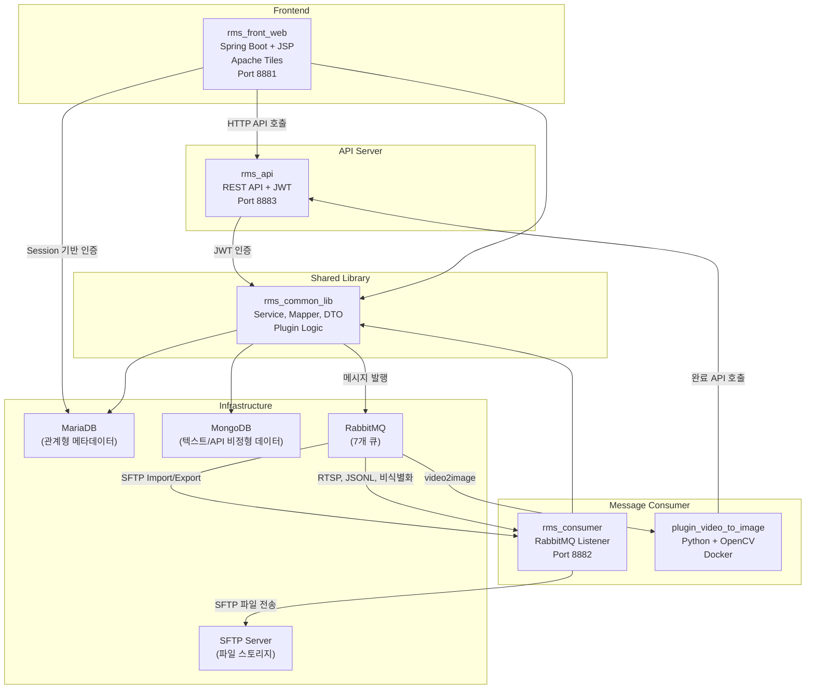
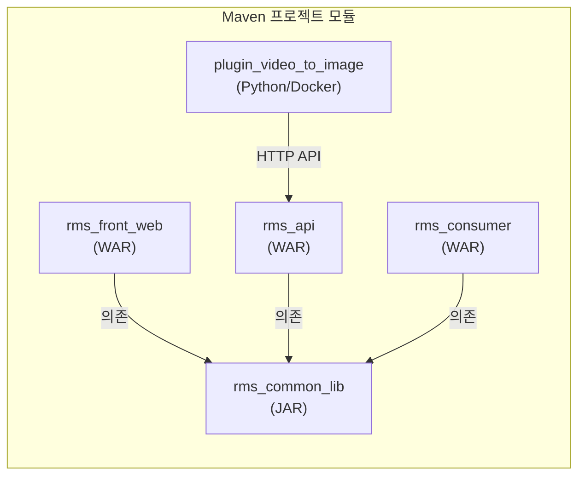
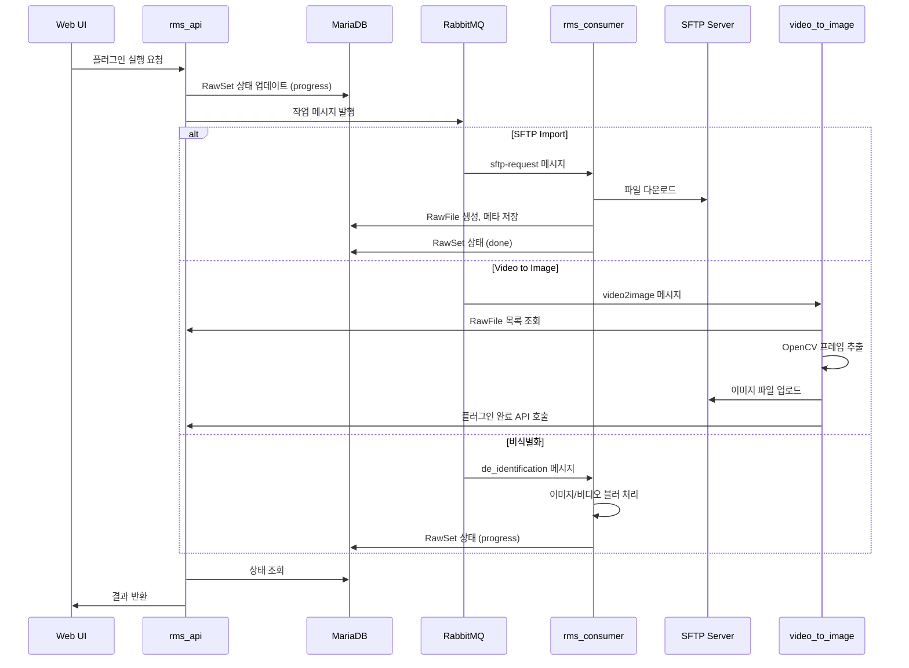

## 전체 시스템 구성

RMS는 **프론트엔드(Spring Boot + JSP)**, **REST API 서버(Spring Boot)**, **메시지 Consumer(Spring Boot)**, **Python 플러그인**, **공통 라이브러리**의 5개 모듈로 구성된 멀티 프로젝트입니다.

## 모듈 구조 및 의존성

- **rms_common_lib**: 모든 Java 모듈이 공유하는 핵심 라이브러리 (Service, Mapper, DTO/VO, Plugin Logic)
- **rms_api**: 외부(플러그인, 클라이언트) 연동용 REST API, JWT 인증
- **rms_front_web**: 관리자/작업자용 웹 UI, Session 기반 인증
- **rms_consumer**: RabbitMQ 비동기 작업 처리
- **plugin_video_to_image**: Docker 컨테이너로 배포되는 Python 비디오 변환 서비스

## 플러그인 기반 파이프라인

RMS의 핵심 설계는 **플러그인 아키텍처**입니다. 모든 데이터 처리 단계가 독립적인 플러그인으로 정의되며, RawSet에 플러그인을 연결하여 파이프라인을 구성합니다.

### 플러그인 유형

| 유형 | 플러그인 | 처리 방식 |
|------|----------|-----------|
| **Import** | SFTP Import | RabbitMQ → Consumer (비동기) |
| | CCTV RTSP Import | RabbitMQ → Consumer → Docker (비동기) |
| | API File Import | API 직접 호출 (동기) |
| | Excel Import | API 직접 호출 (동기) |
| **Transform** | 비디오→이미지 | RabbitMQ → Python Consumer (비동기) |
| | JSONL→텍스트 | RabbitMQ → Consumer (비동기) |
| | 비식별화 | RabbitMQ → Consumer (비동기) |
| **Refine** | LLM 텍스트 정제 | 웹 UI 도구 (동기) |
| | 이미지 정제 | 웹 UI 도구 (동기) |
| | 비디오 정제 | 웹 UI 도구 (동기) |
| **Export** | SFTP Export | RabbitMQ → Consumer (비동기) |
| | Excel Export | 웹 UI 도구 (동기) |
| | JSON Export | 웹 UI 도구 (동기) |
| | ZIP Export | 웹 UI 도구 (동기) |
| **Profile** | 비디오 기본 메타 | RabbitMQ → Consumer (비동기) |
| | 수동 메타 | API 직접 호출 (동기) |

### 데이터 흐름

## RabbitMQ 큐 구성

| 큐 | Consumer | 용도 |
|----|----------|------|
| `q.{env}.import.sftp-request` | rms_consumer | SFTP 파일 Import |
| `q.{env}.export.sftp-request` | rms_consumer | SFTP 파일 Export |
| `q.{env}.transform.video2image-request` | plugin_video_to_image | 비디오→이미지 변환 |
| `q.{env}.import.cctv-rtsp` | rms_consumer | CCTV RTSP 스트림 수집 |
| `q.{env}.profile.videoBasicMeta` | rms_consumer | 비디오 메타 프로파일링 |
| `q.{env}.transform.jsonl-to-text` | rms_consumer | JSONL→텍스트 변환 |
| `q.{env}.transform.de_identification` | rms_consumer | 이미지/비디오 비식별화 |

환경별 prefix: `local`, `dev`, `prd`

## 데이터베이스 설계

### MariaDB (관계형 데이터)

| 테이블 | 용도 | 관계 |
|--------|------|------|
| `user` | 사용자 정보, 권한 | - |
| `raw_group` | 데이터 그룹 분류 | - |
| `master_raw_set` | 마스터 RawSet (최상위) | - |
| `raw_set` | RawSet (플러그인 실행 단위) | → master_raw_set, plugin |
| `plugin` | 플러그인 정의 | - |
| `plugin_item` | 플러그인 항목 | → plugin |
| `raw_set_plugin_item` | RawSet-플러그인 항목 매핑 | → raw_set, plugin_item |
| `raw_file` | 개별 파일 정보 | - |
| `raw_set_raw_file` | RawSet-파일 연결 (N:M) | → raw_set, raw_file |
| `raw_file_group` | 파일 그룹 | - |
| `meta_key` | 메타데이터 키 정의 | - |
| `raw_file_meta` | 파일별 메타데이터 | → raw_file, meta_key |
| `preset` | 프리셋 정의 | - |
| `preset_item` | 프리셋 항목 | → preset |
| `common_grp_code` | 공통 그룹 코드 | - |
| `common_dtl_code` | 공통 상세 코드 | → common_grp_code |

### MongoDB (비정형 데이터)

| 컬렉션 | 용도 |
|--------|------|
| `text_raw_file_data` | LLM 정제 텍스트 데이터 (rawFileId, masterRawSetKey, text, metaValue) |
| `model_api_data` | Model API 호출 이력 (request, response, apiId, refineData) |

## 인프라 구성

| 컴포넌트 | 역할 | 포트 |
|----------|------|------|
| rms_front_web | 웹 UI | 8881 |
| rms_api | REST API | 8883 |
| rms_consumer | 메시지 처리 | 8882 |
| MariaDB | 관계형 DB | 3308 |
| MongoDB | 문서 DB | 27018 |
| RabbitMQ | 메시지 큐 | 5673 |
| SFTP Server | 파일 스토리지 | 22 |
| Nginx | 리버스 프록시, 이미지 서버 | 443 |
