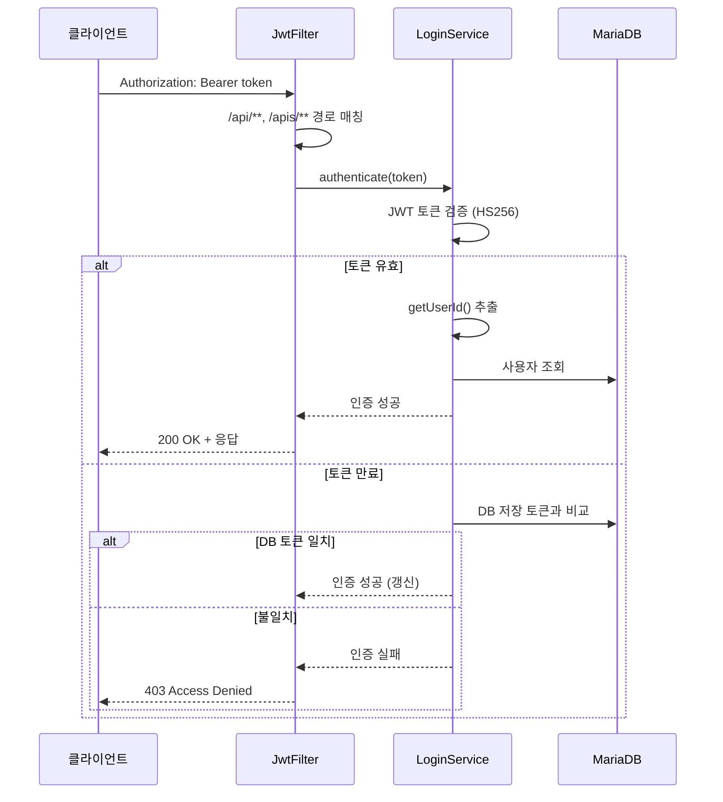

## Spring Boot 2.7 REST API

### JWT 인증

- **알고리즘**: HS256
- **시크릿**: Base64 인코딩
- **토큰 만료**: 7일
- **Claims**: `sub`("RMS"), `id`(userId), `exp`(만료시각), `sessionId`(선택)



### REST API 엔드포인트

| 컨트롤러 | Base Path | 주요 기능 |
|----------|-----------|-----------|
| **RawFileController** | `/api/rawFile` | RawFile 목록/조회, LLM 정제 파일, 메타 조회, 배정 데이터, 필터/태그 메타 (20+ 엔드포인트) |
| **PluginController** | `/api/plugin` | 플러그인 시작/완료/상태, LLM 정제 저장, 파일 Import, SFTP 테스트, MQ 발행 (25+ 엔드포인트) |
| **RawSetController** | `/api/rawSet` | RawSet 조회, 플러그인 실행, SFTP 수동 실행, 통계, 그룹 (10+ 엔드포인트) |
| **ManageController** | `/api/manage` | 사용자 CRUD, Raw 그룹 CRUD, 배정 관리, 카테고리 (15+ 엔드포인트) |
| **ModelApiController** | `/api/modelApi` | Model API 호출, 피드백, AI 정제, 이력 (12+ 엔드포인트) |
| **FileDownLoadController** | `/download` | 단일 파일, 목록 ZIP, 전체 ZIP 다운로드 |
| **PresetController** | `/api/preset` | 메타 프리셋 저장, Addon 프리셋 CRUD |
| **AddonController** | `/api/addon` | Addon 메타 목록 |
| **MonitoringController** | `/api/monitoring` | CCTV 모니터링, 수집기 상태, 수집 차트, 녹화 영상 |
| **ContainerController** | `/apis/container` | Docker 컨테이너 실행/중지/재시작/삭제/조회 |

### 서비스 레이어 (rms_common_lib)

| 서비스 | 역할 |
|--------|------|
| **RawFileService** | RawFile CRUD, 플러그인 연결 파일 조회, 정제 데이터, 메타 관리, 배정 |
| **RawSetService** | RawSet CRUD, 플러그인 실행, 이력 관리, MQ 메시지 발행, 배정 |
| **PluginService** | 플러그인 CRUD, 실행/완료 처리, 다음 RawSet 결정 로직 |
| **UserService** | 사용자 CRUD, 배정, 권한 관리 |
| **ModelApiService** | 외부 AI Model API 호출, 이력 저장, 피드백, 정제 |
| **TextRawFileDataService** | MongoDB 텍스트 데이터 CRUD |
| **ContainerService** | Docker 컨테이너 원격 관리 (SSH 기반) |
| **LoginService** | JWT 인증, 토큰 검증, 사용자 조회 |
| **CodeService** | 공통 코드 조회 |

### 플러그인 서비스

| 플러그인 서비스 | 역할 |
|----------------|------|
| **PluginSFTPService** | SFTP Import/Export, 연결 테스트 (JSch) |
| **PluginDeIdentificationService** | 이미지/비디오 비식별화 (블러) |
| **PluginLLMService** | LLM 연동 텍스트 정제, 텍스트 수집 |
| **PluginImportFileService** | API 통한 파일 Import |
| **PluginImportExcelService** | Excel 파일 Import, JSON→텍스트 변환 |
| **PluginJsonlToTextService** | JSONL→텍스트 변환 |
| **PluginRTSPService** | RTSP 수집기 Docker 컨테이너 실행 |
| **PluginProfileVideoBasicMeta** | FFprobe 기반 비디오 메타 추출 |
| **TransformVideoRefineService** | 비디오 정제 처리 |
| **ExportTextToExcelService** | 텍스트 데이터 Excel Export |
| **ExportTextToJsonService** | 텍스트 데이터 JSON Export |
| **ExportFileToZipService** | 파일 ZIP 압축 Export |

## RabbitMQ Consumer (rms_consumer)

각 리스너는 `@RabbitListener`로 큐를 구독하고, 메시지 수신 시 해당 플러그인 서비스를 호출합니다.

| Listener | 큐 | 처리 |
|----------|-----|------|
| **PluginImportSFTPListener** | `import.sftp-request` | SFTP Import → 파일 다운로드 → RawFile 생성 |
| **PluginExportSFTPListener** | `export.sftp-request` | SFTP Export → 파일 업로드 → 상태 done |
| **PluginImportRTSPListener** | `import.cctv-rtsp` | RTSP 수집기 Docker 컨테이너 실행 |
| **PluginProfileVideoBasicMetaListener** | `profile.videoBasicMeta` | 비디오 메타 추출 → 완료 처리 |
| **PluginTransformJsonlToTextListener** | `transform.jsonl-to-text` | JSONL→텍스트 변환 → 상태 done |
| **PluginDeIdentificationListener** | `transform.de_identification` | 비식별화 처리 → 상태 progress |

**메시지 포맷 (PluginParameterVo)**:
```json
{
  "rawSetId": "RS001",
  "masterRawSetKey": "MK001",
  "userId": "admin",
  "parameters": {
    "host": "sftp.example.com",
    "port": 22,
    "username": "user",
    "password": "pass",
    "remotePath": "/data/input"
  }
}
```

## 데이터 액세스

### MyBatis (MariaDB)

- **Mapper**: 12개 인터페이스 (RawFile, RawSet, Plugin, User, Addon, Preset, ModelApi, AdditionalData, Container, Code, RawGroup, Login)
- **XML Mapper**: `resources/mybatis/mapper/` 디렉터리에 12개 XML
- **RawFileMapper** 단독으로 100개 이상의 SQL 메서드 보유

### Spring Data MongoDB

- **TextRawFileDataRepository**: LLM 정제 텍스트 데이터 CRUD
- **ModelApiDataRepository**: Model API 호출 이력/응답 데이터
- **MongoConfig**: 커스텀 MongoDB 설정

## Python 플러그인 (plugin_video_to_image)

- **RabbitMQ Consumer**: pika 라이브러리로 `video2image-request` 큐 구독
- **처리 흐름**:
  1. API 호출로 RawFile 목록 조회 (Before 상태)
  2. OpenCV로 비디오 프레임 추출 (FPS, 해상도 커스텀 가능)
  3. JSON 센서 데이터 보간 및 프레임별 메타 매핑
  4. SFTP로 이미지 파일 업로드 (SSHManager)
  5. API 호출로 플러그인 완료 처리
- **Docker**: `python:3.10` 기반, 볼륨 마운트로 파일 공유

## 환경별 설정

| 항목 | local | dev | prd |
|------|-------|-----|-----|
| rms_front_web | 7881 | 8881 | - |
| rms_api | 7883 | 8883 | - |
| rms_consumer | 7882 | 8882 | - |
| RabbitMQ 큐 prefix | `q.local.` | `q.dev.` | `q.prd.` |
| 파일 스토리지 | UNC 경로 | `/mnt/data/service_rms` | `/mnt/data/prd_service_rms` |
