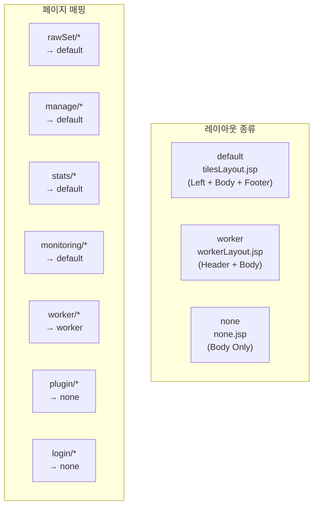

## Spring Boot + JSP 웹 애플리케이션

RMS 프론트엔드는 Spring Boot 2.7 + JSP + Apache Tiles 기반의 서버 사이드 렌더링 웹 애플리케이션입니다.

### 기술 스택

- **서버**: Spring Boot 2.7.4 (WAR 패키징)
- **뷰**: JSP/JSTL + Apache Tiles 3.0.8
- **JavaScript**: jQuery 3.6.0, jQuery UI 1.13.0
- **비디오**: Plyr.js (비디오 정제 도구)
- **유틸**: Moment.js (날짜/시간), LocalForage (로컬 스토리지)
- **인증**: Spring Session JDBC
- **스타일**: 커스텀 CSS (도메인별 분리)

### Apache Tiles 레이아웃



- **default**: 관리자용 레이아웃 (좌측 사이드바 + 본문 + 푸터)
- **worker**: 작업자용 레이아웃 (상단 헤더 + 본문)
- **none**: 독립 페이지 (플러그인 도구, 로그인 등)

### 페이지 구조

| 도메인 | 주요 페이지 | 기능 |
|--------|------------|------|
| **로그인** | login.jsp | Session 기반 인증 |
| **RawSet 관리** | rawSetList, rawSetDetail, createRawSet | RawSet CRUD, 플러그인 실행, 마스터 키 관리 |
| **플러그인 도구** | imageRefineTool | 이미지 정제 (캔버스 기반) |
| | videoRefine | 비디오 정제 (Plyr.js 플레이어) |
| | textRefine, textRefineTool | LLM 텍스트 정제 |
| | textRefineByJsonTool | JSON 기반 텍스트 정제 |
| | importFileTool, importExcelTool | 파일/Excel Import |
| | exportExcelTool, exportJsonTool, exportZipFile | Excel/JSON/ZIP Export |
| | searchHistoryTool | 검색 이력 도구 |
| | refineDataView, refineDataByJsonView | 정제 완료 데이터 뷰어 |
| | pluginDetail | 플러그인 실행 상세 |
| **사용자 관리** | userList, userDetail | 사용자 CRUD, 권한 관리 |
| **카테고리 관리** | rawSetCategoryList, createRawSetCategory | RawSet 카테고리 CRUD |
| **플러그인 관리** | pluginList, managePlugin | 플러그인 등록/관리 |
| **프리셋** | createPreset, listPreset, listAddonPreset | 메타/Addon 프리셋 관리 |
| **Model API** | modelApiList, manageModelApi, modelAnalytics | AI 모델 API 관리, 분석 |
| **통계** | llmSetStats, workerStats, workerStatsDetail | 셋 통계, 작업자 통계 |
| **모니터링** | monitoring, recordedVideo | CCTV 수집 현황, 녹화 영상 |
| **작업자** | myWork, myPage | 배정된 작업, 개인 설정 |
| **Addon** | fileImage | 이미지 파일 Addon |

### JavaScript 구조

```
static/
├── js/
│   ├── common.js              # 공통 유틸, 로그인 체크, 템플릿 엔진
│   ├── aistudio.flowchart.v1.js  # 플러그인 플로우차트 시각화
│   ├── rawSet/                 # RawSet 도메인 JS
│   ├── plugin/                 # 플러그인 도메인 JS
│   ├── manage/                 # 관리 도메인 JS
│   ├── stats/                  # 통계 도메인 JS
│   ├── worker/                 # 작업자 도메인 JS
│   ├── addon/                  # Addon 도메인 JS
│   ├── modelApi/               # Model API 도메인 JS
│   └── preset/                 # 프리셋 도메인 JS
├── css/                        # 도메인별 스타일시트
└── lib/
    ├── jquery-3.6.0.min.js
    ├── jquery-ui.min.js
    ├── jquery.slimscroll.min.js
    ├── plyr.js                 # 비디오 플레이어
    ├── moment.min.js           # 날짜/시간
    └── localforage.js          # 로컬 스토리지
```

### 인증 방식

- **프론트엔드(웹)**: Spring Session JDBC 기반 세션 인증
- **API 호출**: jQuery AJAX로 rms_api에 JWT Bearer 토큰 전송
- 로그인 시 세션 생성 + JWT 토큰 발급 → API 호출 시 토큰 사용

### 역할 기반 UI 분리

- **관리자(Admin)**: 좌측 사이드바 레이아웃, RawSet/사용자/플러그인/통계 전체 관리
- **작업자(Worker)**: 상단 헤더 레이아웃, 배정된 작업만 표시 (myWork, myPage)
