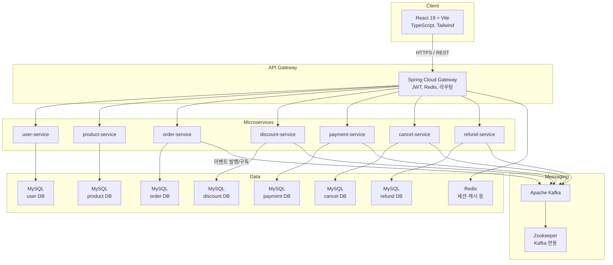

## 전체 구성

클라이언트(React + Vite)는 **Spring Cloud Gateway**를 통해 각 마이크로서비스에 접근합니다. 도메인별로 **독립 MySQL**을 두고, 세션·캐시 등에는 **Redis**, 서비스 간 이벤트에는 **Kafka**(Zookeeper 연동)를 사용하는 형태입니다.

## 주문·결제·취소·환불 흐름

주문 생성 이후 결제가 이어지고, 취소·환불 시나리오에서는 **도메인 서비스 간 동기 API(Feign 등)**와 **Kafka 이벤트**가 함께 쓰일 수 있습니다. 실패 시 **보상 트랜잭션(Saga)** 관점으로 상태를 맞추는 패턴을 학습·적용하는 것이 이 프로젝트의 핵심 중 하나입니다. 상세 시퀀스는 서비스별 구현과 이벤트 설계에 따라 달라질 수 있으므로, 게이트웨이 진입 → 주문/결제 서비스 → 메시지 브로커 → 후속 서비스 순으로 추적하면 전체 흐름을 파악하기 쉽습니다.

## 인프라·배포

컨테이너 이미지, Kubernetes, CI/CD(GitHub Actions → GHCR), 관측(Prometheus 등)에 대한 구체적인 구성은 **인프라** 탭에서 다룹니다.
