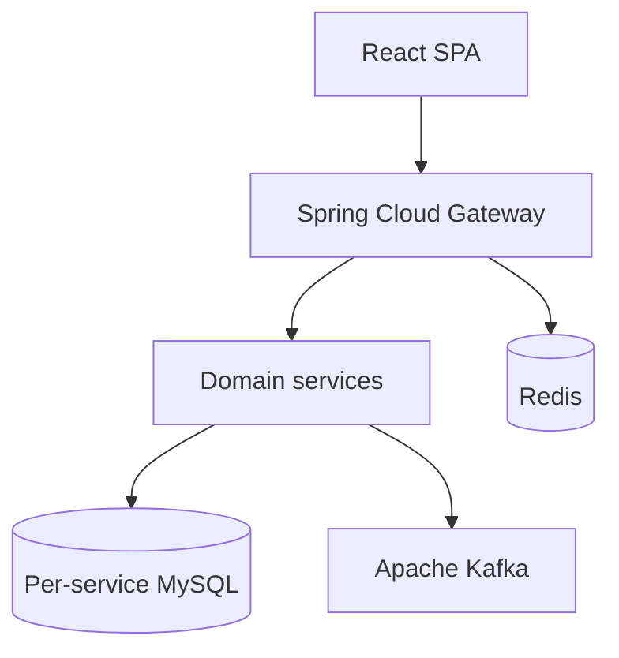

## 핵심 기술 (한 줄 요약)

**React(Vite) 클라이언트 → Spring Cloud Gateway → 도메인별 Spring Boot 서비스**이며, 데이터는 **서비스별 MySQL**, 세션·횡단 관심사는 **Redis**, 서비스 간 이벤트는 **Kafka(Zookeeper)**로 흐릅니다.

## 기술적 도전과 해결

### Challenge: MSA에서 “지금 당장 맞아야 하는 것”과 “나중에 맞아도 되는 것”

**상황** — 주문·결제·할인 조합은 사용자가 즉시 결과를 봐야 합니다.

**문제** — 전부 이벤트만 쓰면 UX가 복잡해지고, 전부 동기만 쓰면 결합도가 높아집니다.

**접근** — **OpenFeign 동기 호출**로 즉시 일관성이 필요한 흐름을 처리하고, 취소·환불 등 후속 단계는 **Kafka 이벤트 + 보상(Saga) 학습 범위**로 나눴습니다.

**해결** — 게이트웨이를 단일 진입점으로 두어 클라이언트가 서비스마다 호스트를 알 필요 없게 했습니다.

**성과** — “실무에서 흔한 타협”을 **의도적으로 선택**한 레퍼런스가 되었습니다.

### Challenge: 데이터 소유권을 DB까지 분리

**상황** — 모놀리식 스키마를 나누면 마이그레이션·조인 전략이 바뀝니다.

**문제** — 한 DB를 공유하면 MSA 이점이 줄어듭니다.

**접근** — **서비스별 MySQL**을 두고, 조합이 필요하면 API/게이트웨이 aggregation 패턴을 씁니다.

**해결** — 도메인 경계를 user/product/order/discount/payment/cancel/refund로 고정했습니다.

**성과** — 장애·스케일을 **서비스 단위로 격리**해 실험하기 쉬워졌습니다.

## 구성 한눈에

## 설계 메모

- 인프라·CI/CD·관측 세부는 **인프라** 탭에 두고, 여기서는 **비즈니스 흐름과 경계 선택**만 다룹니다.
