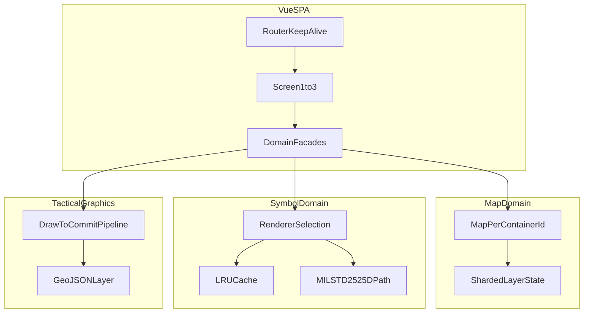

## 핵심 기술 (한 줄 요약)

**Vue 3 + OpenLayers 10** 위에 **MIL-STD-2525D** 심볼·전술 그래픽·**Vue Flow ORBAT**를 얹었고, 외부 타일(XYZ 등)과 브라우저 내 상태만을 전제로 **퍼사드·멀티 맵·이중 렌더 전략**으로 경계를 나눴습니다.

## 기술적 도전과 해결

### 도전 과제 1: 지도, 군사 부호, 편성표가 복합된 대규모 GIS 프론트엔드의 결합도 제어

**상황** — 본 플랫폼은 지도의 기본 조작뿐만 아니라 MIL-STD 규격 부호의 정밀한 렌더링, 복잡한 전술 그래픽의 드로잉, 그리고 부대 편성을 시각화하는 ORBAT 다이어그램이 한 화면에서 조화롭게 동작해야 했습니다.

**문제** — 각 기능 모듈이 OpenLayers나 특정 군사 부호 렌더러에 직접 의존하게 되면, 사소한 규격 변경이나 SDK 버전 업그레이드 시 시스템 전반에 걸친 대규모 수정이 불가피했습니다.

**접근** — **퍼사드(Facade) 패턴과 모듈별 매니저 구조**를 통해 라이브러리 의존성을 캡슐화했습니다. UI 컴포넌트는 지도 SDK의 내부 객체를 직접 다루는 대신, 퍼사드 계층에서 제공하는 추상화된 API만을 호출하도록 강제했습니다.

**해결** — 부대 심볼, 레이어 관리, 인터랙션 책임을 독립적인 모듈로 분리하고, 렌더러(milsymbol 등)의 교체나 성능 튜닝이 퍼사드 내부에서만 이루어지도록 설계하여 외부 노출을 차단했습니다.

**성과** — 신규 작전 화면을 추가하더라도 **기존 비즈니스 로직을 재사용**하여 개발 속도를 획기적으로 높였으며, 기술 스택의 변경이 상위 UI 계층에 영향을 주지 않는 유연한 구조를 달성했습니다.

### 도전 과제 2: 독립된 멀티 맵 환경에서의 상태 일관성 및 권한 제어

**상황** — 라우팅이나 모달 등 복수의 DOM 컨테이너에서 독립적인 지도 인스턴스가 동시에 실행되어야 하며, 각 지도마다 서로 다른 레이어 가시성과 편집 권한을 가져야 했습니다.

**문제** — 전역 상태 관리 저장소(Pinia)를 단순하게 사용할 경우 서로 다른 지도 인스턴스 간의 상태 간섭이 발생하거나, 반대로 상태를 파편화하면 관리 규칙이 어긋나는 문제가 있었습니다.

**접근** — **상태 샤딩(State Sharding) 프로토콜**을 도입했습니다. 각 지도의 식별자(ID)를 키로 사용하여 레이어 가시성과 권한 정보를 분리 저장하고, 이를 통합 관리하는 계층형 스토어 구조를 설계했습니다.

**해결** — 수동 가시성 할당(Assignment) 모드와 규칙 기반 자동 필터링(Rule) 모드를 동시에 지원하여, 사용자가 설정한 복잡한 가시성 정책이 실시간으로 지도에 반영되도록 구현했습니다.

**성과** — 동일한 플랫폼 코드베이스를 유지하면서도 **“화면별로 상이한 작전 뷰(View)”**를 코드 중복 없이 구현했으며, 대규모 데이터 조회 시 불필요한 렌더링을 억제하여 성능을 최적화했습니다.

### 도전 과제 3: 군사 규격 준수와 대량 심볼 렌더링 성능의 상충 해결

**상황** — MIL-STD-2525D 규격을 정밀하게 준수하면서도, 수천 개의 부대 부호가 배치된 상황에서 끊김 없는 지도 조작(Pan/Zoom) 성능을 보장해야 했습니다.

**문제** — 모든 심볼을 실시간으로 다시 그리면 CPU/GPU 부하가 심해지고, 반대로 이미지 형식으로 미리 생성해두면 규격에 따른 실시간 스타일 변경(아군/적군 상태 전환 등)에 대응하기 어려웠습니다.

**접근** — **이중 렌더링 전략 및 LRU 캐시 시스템**을 구축했습니다. 빈번하게 사용되는 부대 심볼은 SVG 소스를 캐싱하여 재사용하고, 정밀한 전술 그래픽은 그려지는 즉시 레이어 인스턴스로 동결하는 단방향 파이프라인을 설계했습니다.

**해결** — 맵 엔진(OpenLayers)의 렌더링 주기와 심볼 생성 주기를 분리하고, 캔버스 최적화 기법을 적용하여 대량의 레이어 위에서도 부드러운 인터랙션을 유지하도록 개선했습니다.

**성과** — **군사 규격의 100% 준수**와 **대규모 객체 처리 성능**이라는 두 마리 토끼를 잡았으며, 복잡한 전술 상황에서도 사용자에게 지연 없는 정보를 제공하게 되었습니다.

### Challenge: 복잡한 아키텍처 규칙을 어떻게 팀 전체가 유지할 것인가?

**사례** — 우리가 만든 '퍼사드 패턴'이나 '상태 분리 전략'은 시스템이 커져도 문제가 없게 만드는 훌륭한 도구지만, 코드를 처음 보는 개발자에게는 그저 "지켜야 할 복잡한 절차"로 보일 수 있습니다.

**문제** — 가이드가 없으면 바쁜 일정 속에서 개발자들이 정해진 규칙을 건너뛰고 쉬운 방식(지름길)으로 코드를 짜게 되고, 결국 공들여 만든 시스템 구조가 서서히 무너지게 됩니다.

**해결** — 코드 저장소 안에 **이유가 담긴 문서(ADR)**와 **시각적 가이드**를 직접 포함했습니다. 기술적인 결정이 왜 내려졌는지(Why)를 코드와 함께 두어, 누군가에게 일일이 설명하지 않아도 문서 하나로 설계 의도가 전달되게 했습니다.

**성과** — 코드 리뷰 시 불필요한 논쟁이 줄어들었고, "임시로 만든 우회 코드"가 사라지면서 프로젝트를 깨끗한 아키텍처로 유지할 수 있었습니다.

## 모듈 구조 한눈에

## 설계 메모

- **문서 계층**: 퍼사드 공개 계약·멀티 맵 상태 키·Draw 파이프라인 순서 등 **구현에 바로 쓰는 세부 규칙**은 저장소의 모듈 README·`docs/`에 두고, 아키텍처 문서에서는 **모듈 경계와 데이터·상태 흐름**만 압축해 옮깁니다.
- **이슈 지식화**: MIL-STD·지도/심볼 라이브러리 이슈는 **재현 조건·우회·해결**을 한곳에 묶어 두어, 유사 증상일 때 추적 시간을 줄였습니다.
