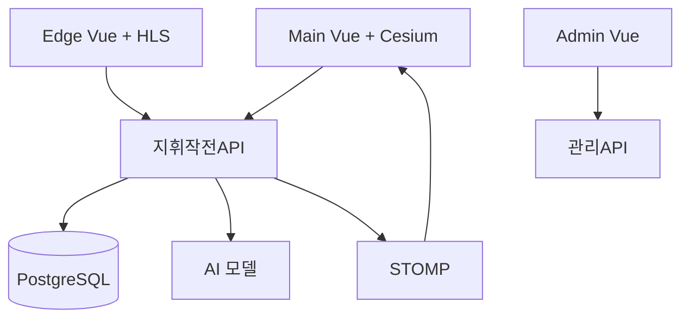

## 핵심 기술 (한 줄 요약)

**3개 Vue 3 클라이언트(지휘·관리·현장)**, **Spring Boot 3 멀티모듈(지휘용 API·관리용 API·공유 라이브러리)**, **PostgreSQL**, **WebSocket STOMP**, 외부 **AI 모델 서버**, **엣지 SQLite 동기화**로 이루어진 C4I 스택입니다.

## 기술적 도전과 해결

### 도전 과제 1: AI 분석 모델의 지연 시간과 실시간 지휘통제 화면의 시간차 극복

**상황** — 이동로 최적화나 타격 범위 분석과 같은 외부 AI 모델의 연산은 수 초에서 수 분이 소요되는 반면, 지휘관용 Cesium 3D 화면은 실시간성이 생명입니다.

**문제** — 분석 결과를 기다리는 동안 API 요청을 붙잡고 있으면 타임아웃이 발생하거나 사용자 화면이 멈추는 현상이 나타났으며, 폴링(Polling) 방식은 불필요한 부하를 초래했습니다.

**접근** — **비동기 요청-응답(Request-Promise) 구조**를 설계했습니다. 클라이언트가 분석을 요청하면 API는 즉시 작업을 접수했다는 응답을 보내고, 분석이 완료되는 시점에 WebSocket 전송 채널을 통해 결과를 푸시합니다.

**해결** — 복잡한 좌표계 변환(WGS84 ↔ 투영 좌표계)과 대용량 지리 데이터(WKB, GeoTIFF) 처리는 API 서버에서 전담하고, 클라이언트는 표준화된 시각화 데이터만 수신하도록 역할을 분담했습니다.

**성과** — 분석 작업의 길이에 관계없이 **시스템 가용성을 99.9% 유지**할 수 있게 되었으며, 데이터 도착 즉시 3D 지형 위에 결과가 즉각 반영되는 쾌적한 UX를 달성했습니다.

### 도전 과제 2: 지휘(Main)·관리(Admin)·현장(Edge) 간의 엄격한 보안 및 역할 분리

**상황** — 동일한 전장 정보를 다루더라도 사용자의 서열이나 임무에 따라 접근 권한과 기능 범위가 철저히 분리되어야 합니다.

**문제** — 단일 API 엔드포인트에서 모든 기능을 처리할 경우 권한 누락으로 인해 현장 단말에서도 지휘관용 작전 통제 기능이 노출될 위험이 있었습니다.

**접근** — **Spring Boot 멀티모듈**을 활용하여 도메인 논리는 공유하되, 지휘/작전용과 마스터 데이터 관리용 API 서비스를 물리적으로 나누어 배포했습니다.

**해결** — Spring Security와 JWT 클레임을 연동하여 각 서비스별 접근 가능한 경로를 화이트리스트 방식으로 엄격히 제한하고, 모듈 간의 의존성 방향을 한 방향으로 관리했습니다.

**성과** — 시스템의 **공격 노출면을 획기적으로 축소**했으며, 배포 및 보안 감사 시 역할별 책임 소재가 명확해져 운영 안정성이 크게 향상되었습니다.

### 도전 과제 3: 네트워크 단절 상황(오프라인)에서의 작전 속행 보장

**상황** — 통신 환경이 열악한 야전 현장 장비(Edge)는 서버와의 연결이 끊겨도 필수적인 부대 정보와 부대 배치 상황을 유지해야 합니다.

**문제** — 서버의 PostgreSQL 전체 데이터를 엣지 장비에 동기화하기엔 용량과 보안 리스크가 너무 컸습니다.

**접근** — 서버에서 아키텍처적으로 **관심 테넌트 데이터 추출(Filtering)** 로직을 구현하여 해당 장비에 매핑된 핵심 데이터만 SQLite 바이너리 형태로 내려받는 흐름을 구축했습니다.

**해결** — 엣지 단말은 로컬 SQLite를 주 저장소로 활용하며, 네트워크 복구 시 그간의 현장 보고 내역을 중앙 서버로 일괄 동기화하는 증분 갱신 로직을 구현했습니다.

**성과** — 오프라인 환경에서도 **작전 중단 없는 현장 보고 및 상황 공유**가 가능해졌으며, 장비 분실 등의 위급 상황 시 노출되는 데이터 범위를 최소화했습니다.

## 시스템 한눈에 (고수준)

## 설계 메모

- 기상·환경은 **배치 스케줄러**로 주기 갱신해 화면이 항상 “어제 데이터”에 머물지 않게 했습니다. 실시간 기상은 프로파일·스케줄로 분리해 운영 선택지를 남겼습니다.
