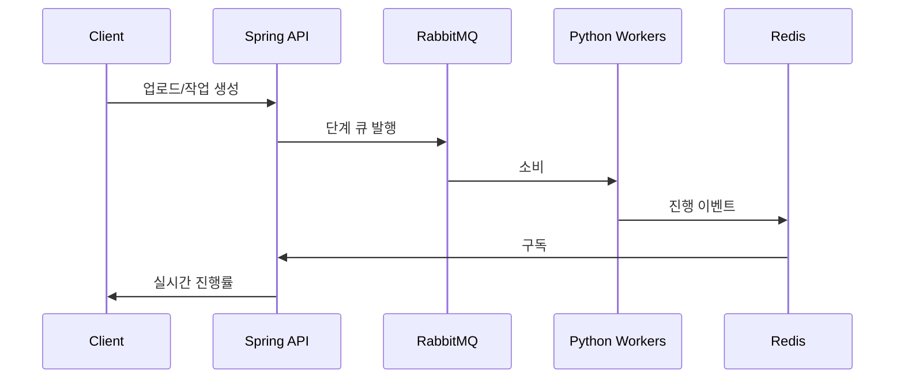

## 핵심 기술 (한 줄 요약)

**Vue 3 + Electron(작업 클라이언트)**와 **Vue 3 웹(백오피스)**, **Spring Boot 3 멀티모듈 API**, **Python AI Consumer 다수**, **RabbitMQ**, **Redis Pub/Sub**, **MariaDB**로 구성된 **이벤트 기반 SaaS**입니다.

## 기술적 도전과 해결

### Challenge: 수 분~수십 분 걸리는 AI 작업과 API 응답 시간 분리

**상황** — 비디오 비식별은 단계가 길고 GPU/CPU 부하가 큽니다.

**문제** — 동기 HTTP로 워커를 호출하면 타임아웃·재시도 지옥이 되고, API 스레드를 점유합니다.

**접근** — 업로드·승인 후 **RabbitMQ에 작업 메시지**를 넣고, API는 즉시 202 성격의 응답으로 끝냈습니다.

**해결** — 단계별 큐(**프레임 추출 → 탐지 → 블러·합성** 등)로 넘기고 워커만 스케일합니다.

**성과** — API는 **짧게 유지**되고, 병목 단계만 워커를 늘려 처리량을 조절할 수 있었습니다.

### Challenge: Python 워커 → Spring → 브라우저 실시간 UX

**상황** — 진행률·완료·오류를 **폴링 없이** 보여줘야 신뢰가 생깁니다.

**문제** — Consumer마다 Spring API를 HTTP 콜백하면 엔드포인트·인증이 폭발합니다.

**접근** — Consumer는 **Redis Pub/Sub**로 이벤트를 올리고, API는 **단일 구독 지점**에서 **실시간 메시지 프로토콜**로 브라우저에 푸시합니다.

**해결** — 진행 집계는 Redis Hash + TTL로 잠깐 두어 DB를 매 이벤트마다 두드리지 않게 했습니다.

**성과** — 워커를 추가해도 **API 계약 변경이 최소**인 채로 실시간 UI를 유지했습니다.

### Challenge: 멀티테넌트 SaaS에서 회사(테넌트)별 처리 대역 분리

**상황** — 회사마다 다른 AI 모델·큐 설정이 필요했습니다.

**문제** — 한 큐에 몰면 한 고객의 대량 작업이 다른 고객을 밀어냅니다.

**접근** — JWT 등에 실린 **회사·큐 메타**를 기준으로 메시지를 라우팅했습니다.

**해결** — durable 큐와 영속 메시지로 브로커 재시작 후에도 미처리 작업을 잃지 않게 했습니다.

**성과** — 테넌트 간 **노이즈 격리**와 운영 설명이 쉬워졌습니다.

## 파이프라인 한눈에

## 설계 메모

- 자동 파이프라인과 수동·제로샷 파이프라인은 **큐를 분리**해 운영 중 트래픽을 섞지 않았습니다. 세부 Consumer 역할·큐 매핑은 **AI/ML 파이프라인** 문서에서 다룹니다.
